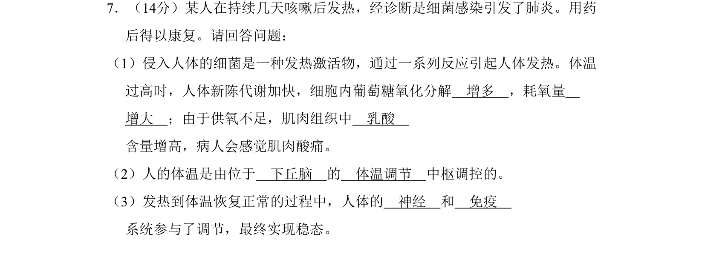
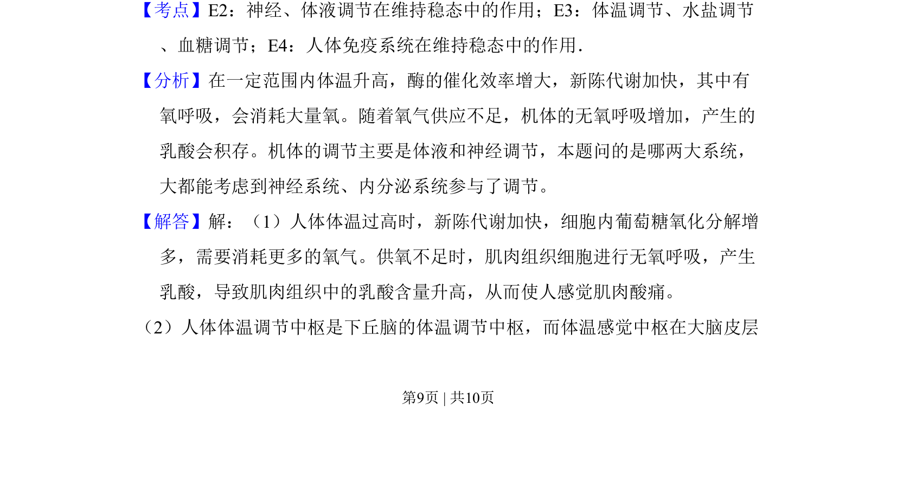
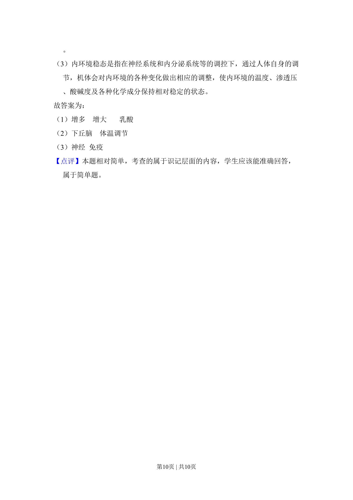

## 题面

## 摘要

考查发热时体温调节与细胞呼吸变化，以及神经、免疫系统参与的稳态调节。

## 关联考点

- [[542-体温调节|体温调节]]
- [[238-无氧呼吸|无氧呼吸]]
- [[156-免疫|免疫调节]]
- [[324-神经调节|神经调节]]

## 答案与解析

> 📄 原 PDF 第 9 页：`素材/真题/北京/2008-2024·（北京）生物高考真题/2009年高考生物试卷（北京）（解析卷）.pdf`
