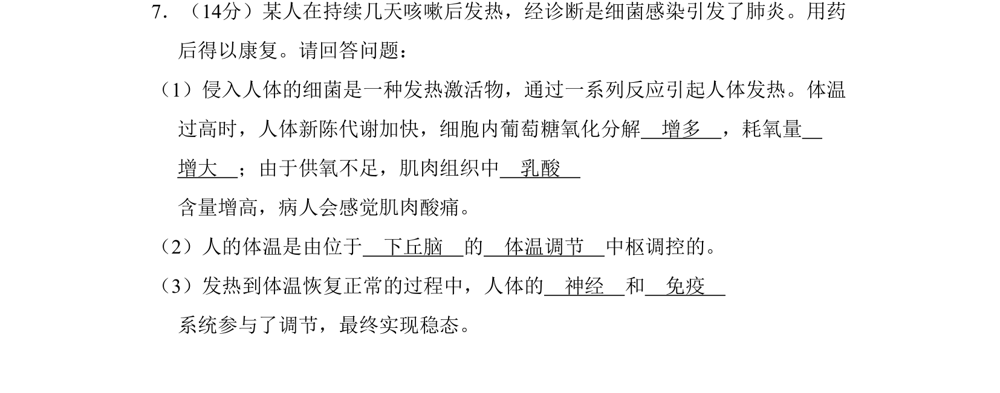
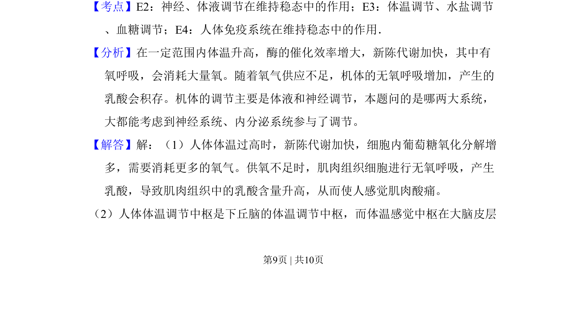
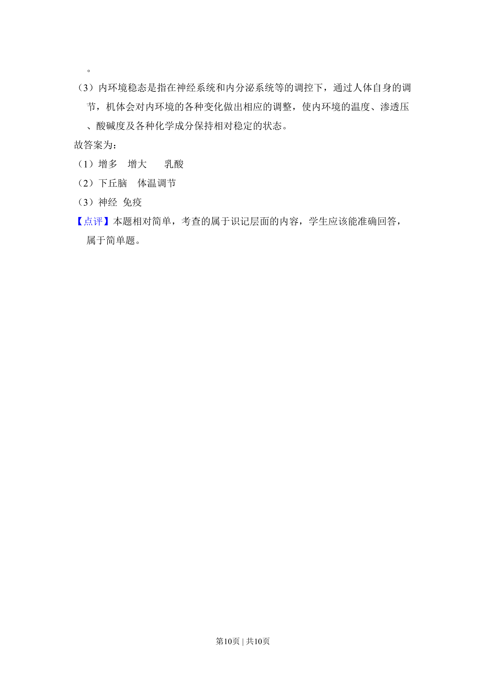

## 题面

## 摘要

考查发热时体温调节与细胞呼吸变化，以及神经、免疫系统参与的稳态调节。

## 关联考点

- [[542-体温调节|体温调节]]
- [[238-无氧呼吸|无氧呼吸]]
- [[156-免疫|免疫调节]]
- [[324-神经调节|神经调节]]

## 答案与解析

> 📄 原 PDF 第 9 页：`素材/真题/北京/2008-2024·（北京）生物高考真题/2009年高考生物试卷（北京）（解析卷）.pdf`

<!-- 题干文本-start -->
## 题干文本
7．（14分）某人在持续几天咳嗽后发热，经诊断是细菌感染引发了肺炎。用药
后得以康复。请回答问题：
（1）侵入人体的细菌是一种发热激活物，通过一系列反应引起人体发热。体温
过高时，人体新陈代谢加快，细胞内葡萄糖氧化分解　增多　，耗氧量　
增大　；由于供氧不足，肌肉组织中　乳酸　
含量增高，病人会感觉肌肉酸痛。
（2）人的体温是由位于　下丘脑　的　体温调节　中枢调控的。
（3）发热到体温恢复正常的过程中，人体的　神经　和　免疫　
系统参与了调节，最终实现稳态。
<!-- 题干文本-end -->

<!-- 解析文本-start -->
## 解析文本
【考点】E2：神经、体液调节在维持稳态中的作用；E3：体温调节、水盐调节
、血糖调节；E4：人体免疫系统在维持稳态中的作用．菁优网版权所有
【分析】在一定范围内体温升高，酶的催化效率增大，新陈代谢加快，其中有
氧呼吸，会消耗大量氧。随着氧气供应不足，机体的无氧呼吸增加，产生的
乳酸会积存。机体的调节主要是体液和神经调节，本题问的是哪两大系统，
大都能考虑到神经系统、内分泌系统参与了调节。
【解答】解：（1）人体体温过高时，新陈代谢加快，细胞内葡萄糖氧化分解增
多，需要消耗更多的氧气。供氧不足时，肌肉组织细胞进行无氧呼吸，产生
乳酸，导致肌肉组织中的乳酸含量升高，从而使人感觉肌肉酸痛。
（2）人体体温调节中枢是下丘脑的体温调节中枢，而体温感觉中枢在大脑皮层
<!-- 解析文本-end -->
