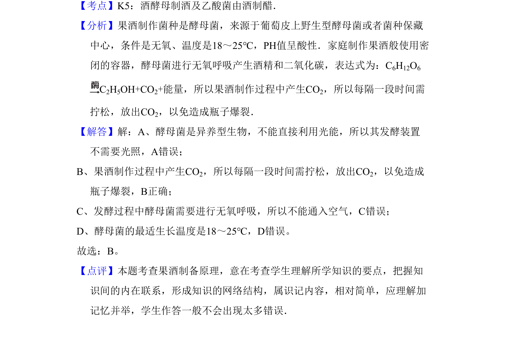

## 题面

## 摘要

家庭制作果酒的操作要求，考查酵母菌发酵条件

## 关联考点

- [[152-酵母菌|酵母菌]]
- [[893-果酒制作|果酒制作]]
- [[238-无氧呼吸|无氧呼吸]]
- [[发酵条件]]

## 答案与解析

> 📄 原 PDF 第 1 页：`素材/真题/北京/2008-2024·（北京）生物高考真题/2010年高考生物试卷（北京）（解析卷）.pdf`

<!-- 题干文本-start -->
## 题干文本
1．（6分）在家中用鲜葡萄制作果酒时，正确的操作是（　　）
A．让发酵装置接受光照B．给发酵装置适时排气
C．向发酵装置通入空气D．将发酵装置放在45℃处
<!-- 题干文本-end -->

<!-- 解析文本-start -->
## 解析文本
【考点】K5：酒酵母制酒及乙酸菌由酒制醋．菁优网版权所有
【分析】果酒制作菌种是酵母菌，来源于葡萄皮上野生型酵母菌或者菌种保藏
中心，条件是无氧、温度是18～25℃，PH值呈酸性．家庭制作果酒般使用密
闭的容器，酵母菌进行无氧呼吸产生酒精和二氧化碳，表达式为：C6H12O6
C2H5OH+CO2+能量，所以果酒制作过程中产生CO2，所以每隔一段时间需
拧松，放出CO2，以免造成瓶子爆裂．
【解答】解：A、酵母菌是异养型生物，不能直接利用光能，所以其发酵装置
不需要光照，A错误；
B、果酒制作过程中产生CO2，所以每隔一段时间需拧松，放出CO2，以免造成
瓶子爆裂，B正确；
C、发酵过程中酵母菌需要进行无氧呼吸，所以不能通入空气，C错误；
D、酵母菌的最适生长温度是18～25℃，D错误。
故选：B。
【点评】本题考查果酒制备原理，意在考查学生理解所学知识的要点，把握知
识间的内在联系，形成知识的网络结构，属识记内容，相对简单，应理解加
记忆并举，学生作答一般不会出现太多错误．
<!-- 解析文本-end -->
