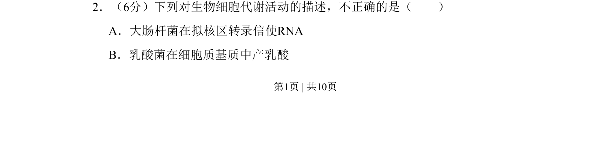
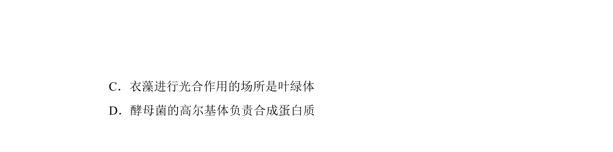
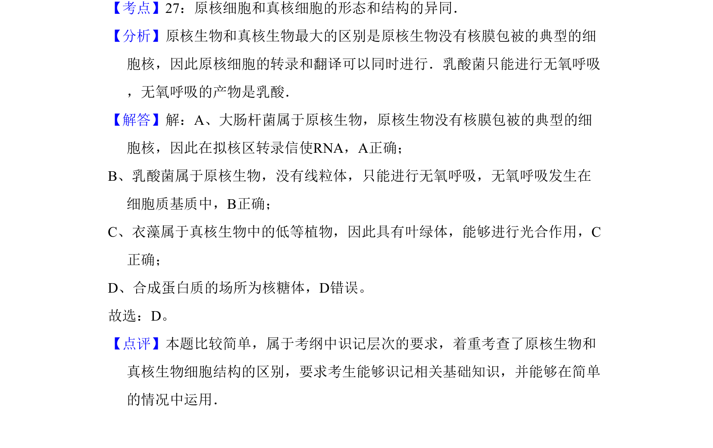

## 题面

## 摘要

本题考查原核细胞的转录场所与无氧呼吸类型等细胞代谢活动正误判断。

## 关联考点

- [[298-转录|转录]]
- [[238-无氧呼吸|无氧呼吸]]
- [[205-原核细胞|原核细胞]]
- [[细胞质基质]]

## 答案与解析

> 📄 原 PDF 第 1 页：`素材/真题/北京/2008-2024·（北京）生物高考真题/2010年高考生物试卷（北京）（解析卷）.pdf`
