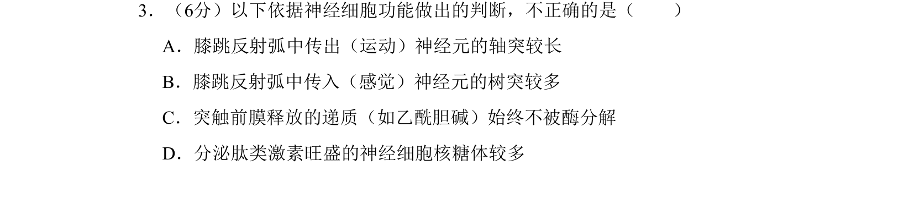
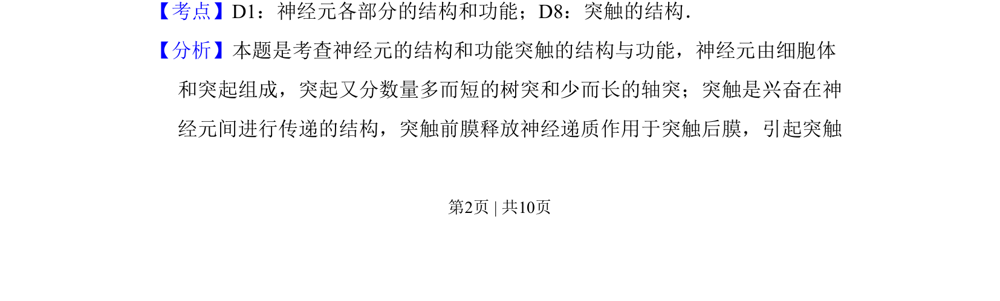
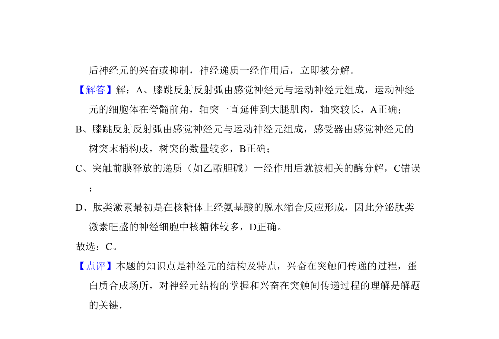

## 题面

## 摘要

该题通过膝跳反射弧和神经递质等实例，考查神经元结构、突触传递与细胞器功能。

## 关联考点

- [[神经元结构]]
- [[326-突触|突触]]
- [[325-神经递质|神经递质]]
- [[225-核糖体|核糖体]]

## 答案与解析

> 📄 原 PDF 第 2 页：`素材/真题/北京/2008-2024·（北京）生物高考真题/2010年高考生物试卷（北京）（解析卷）.pdf`
