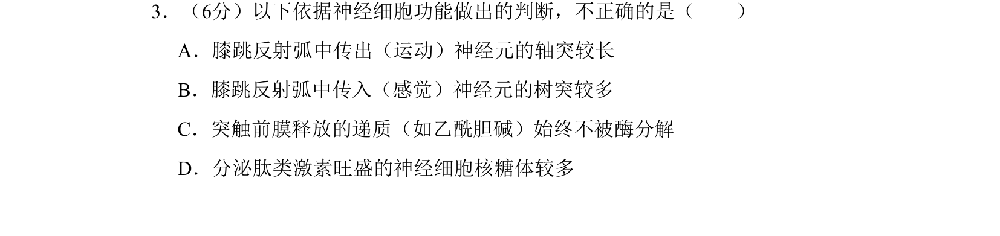
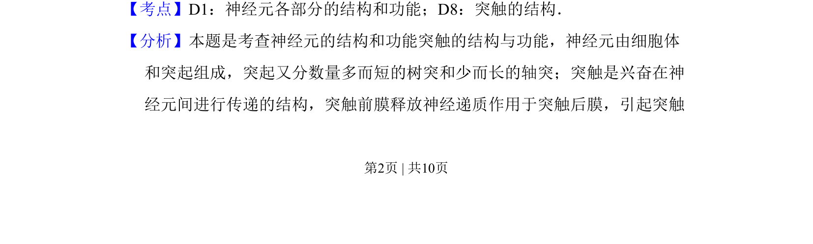
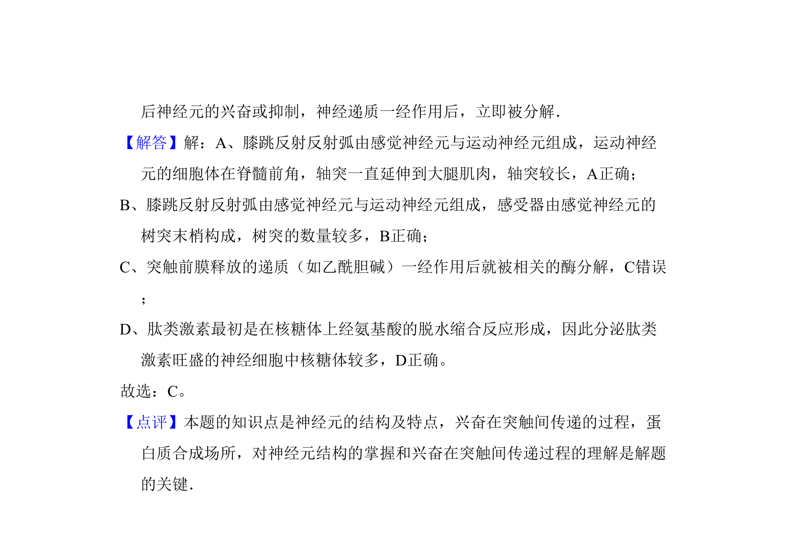

## 题面

## 摘要

该题通过膝跳反射弧和神经递质等实例，考查神经元结构、突触传递与细胞器功能。

## 关联考点

- [[神经元结构]]
- [[326-突触|突触]]
- [[325-神经递质|神经递质]]
- [[225-核糖体|核糖体]]

## 答案与解析

> 📄 原 PDF 第 2 页：`素材/真题/北京/2008-2024·（北京）生物高考真题/2010年高考生物试卷（北京）（解析卷）.pdf`

<!-- 题干文本-start -->
## 题干文本
3．（6分）以下依据神经细胞功能做出的判断，不正确的是（　　）
A．膝跳反射弧中传出（运动）神经元的轴突较长
B．膝跳反射弧中传入（感觉）神经元的树突较多
C．突触前膜释放的递质（如乙酰胆碱）始终不被酶分解
D．分泌肽类激素旺盛的神经细胞核糖体较多
<!-- 题干文本-end -->

<!-- 解析文本-start -->
## 解析文本
【考点】D1：神经元各部分的结构和功能；D8：突触的结构．菁优网版权所有
【分析】本题是考查神经元的结构和功能突触的结构与功能，神经元由细胞体
和突起组成，突起又分数量多而短的树突和少而长的轴突；突触是兴奋在神
经元间进行传递的结构，突触前膜释放神经递质作用于突触后膜，引起突触
<!-- 解析文本-end -->
