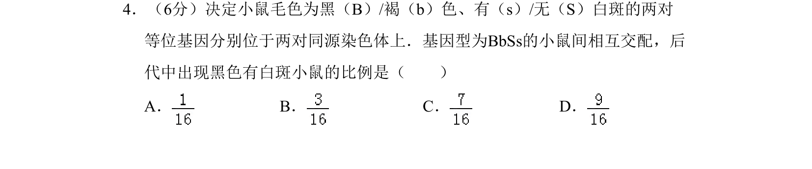
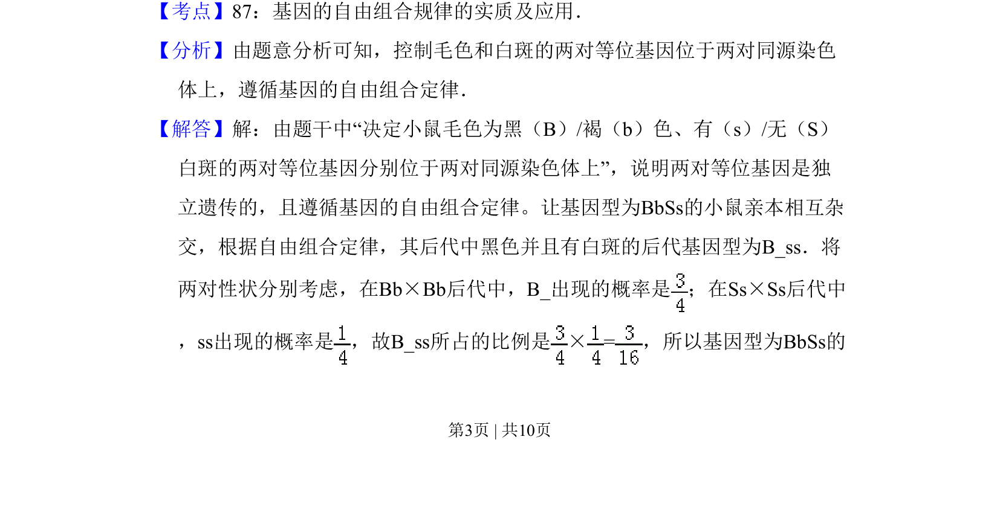
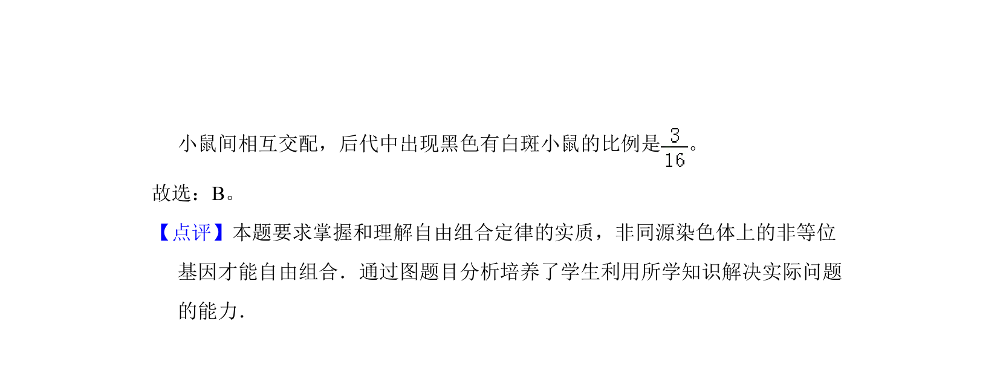

## 题面

## 摘要

小鼠毛色与白斑遗传遵循自由组合定律，计算BbSs互交后代中黑色有白斑的比例。

## 关联考点

- [[580-基因自由组合定律|基因自由组合定律]]
- [[195-基因型|基因型]]
- [[201-表现型|表现型]]
- [[比例计算]]

## 答案与解析

> 📄 原 PDF 第 3 页：`素材/真题/北京/2008-2024·（北京）生物高考真题/2010年高考生物试卷（北京）（解析卷）.pdf`
