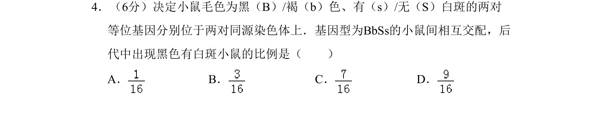
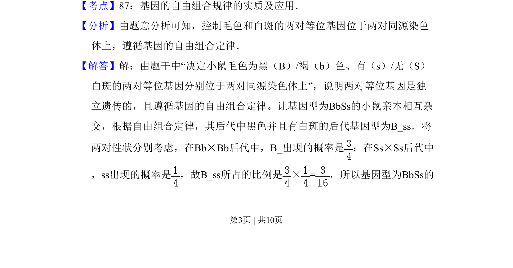
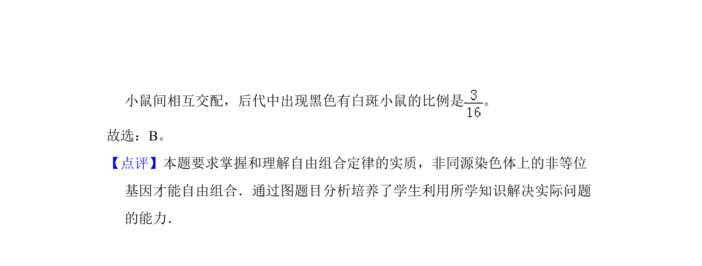

## 题面

## 摘要

小鼠毛色与白斑遗传遵循自由组合定律，计算BbSs互交后代中黑色有白斑的比例。

## 关联考点

- [[580-基因自由组合定律|基因自由组合定律]]
- [[195-基因型|基因型]]
- [[201-表现型|表现型]]
- [[比例计算]]

## 答案与解析

> 📄 原 PDF 第 3 页：`素材/真题/北京/2008-2024·（北京）生物高考真题/2010年高考生物试卷（北京）（解析卷）.pdf`

<!-- 题干文本-start -->
## 题干文本
4．（6分）决定小鼠毛色为黑（B）/褐（b）色、有（s）/无（S）白斑的两对
等位基因分别位于两对同源染色体上．基因型为BbSs的小鼠间相互交配，后
代中出现黑色有白斑小鼠的比例是（　　）
A．B．C．D．
<!-- 题干文本-end -->

<!-- 解析文本-start -->
## 解析文本
【考点】87：基因的自由组合规律的实质及应用．菁优网版权所有
【分析】由题意分析可知，控制毛色和白斑的两对等位基因位于两对同源染色
体上，遵循基因的自由组合定律．
【解答】解：由题干中“决定小鼠毛色为黑（B）/褐（b）色、有（s）/无（S）
白斑的两对等位基因分别位于两对同源染色体上”，说明两对等位基因是独
立遗传的，且遵循基因的自由组合定律。让基因型为BbSs的小鼠亲本相互杂
交，根据自由组合定律，其后代中黑色并且有白斑的后代基因型为B_ss．将
两对性状分别考虑，在Bb×Bb后代中，B_出现的概率是 ；在Ss×Ss后代中
，ss出现的概率是 ，故B_ss所占的比例是×=，所以基因型为BbSs的
<!-- 解析文本-end -->
