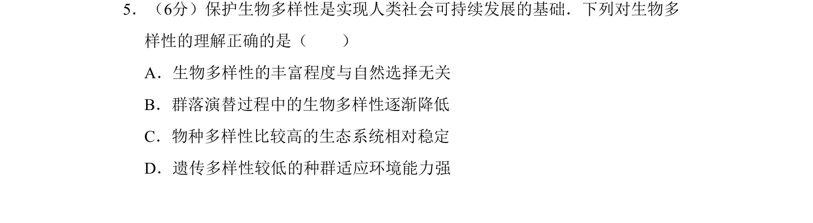
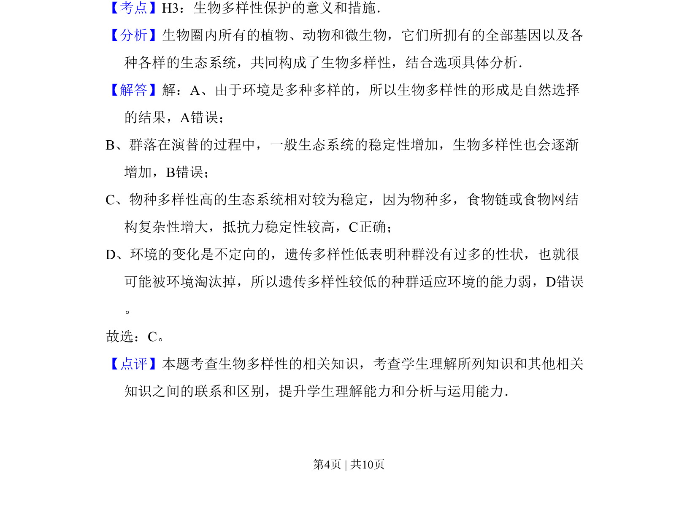

## 题面

## 摘要

本题考查生物多样性的形成、演替影响、物种多样性与生态系统稳定性、遗传多样性与适应能力的关系。

## 关联考点

- [[144-生物多样性|生物多样性]]
- [[184-自然选择|自然选择]]
- [[407-群落演替|群落演替]]
- [[399-生态系统稳定性|生态系统稳定性]]

## 答案与解析

> 📄 原 PDF 第 4 页：`素材/真题/北京/2008-2024·（北京）生物高考真题/2010年高考生物试卷（北京）（解析卷）.pdf`
