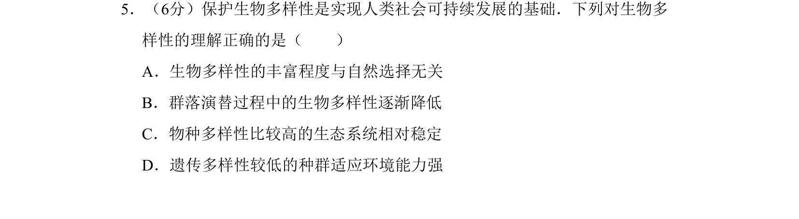
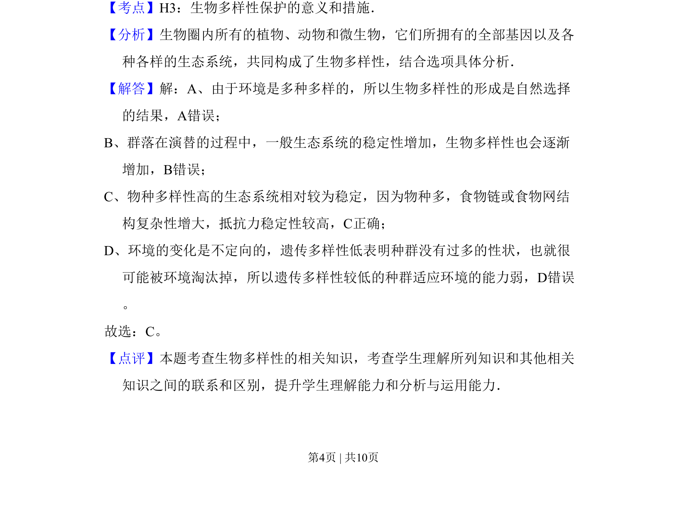

## 题面

## 摘要

本题考查生物多样性的形成、演替影响、物种多样性与生态系统稳定性、遗传多样性与适应能力的关系。

## 关联考点

- [[144-生物多样性|生物多样性]]
- [[184-自然选择|自然选择]]
- [[407-群落演替|群落演替]]
- [[855-生态系统的稳定性|生态系统稳定性]]

## 答案与解析

> 📄 原 PDF 第 4 页：`素材/真题/北京/2008-2024·（北京）生物高考真题/2010年高考生物试卷（北京）（解析卷）.pdf`

<!-- 题干文本-start -->
## 题干文本
5．（6分）保护生物多样性是实现人类社会可持续发展的基础．下列对生物多
样性的理解正确的是（　　）
A．生物多样性的丰富程度与自然选择无关
B．群落演替过程中的生物多样性逐渐降低
C．物种多样性比较高的生态系统相对稳定
D．遗传多样性较低的种群适应环境能力强
<!-- 题干文本-end -->

<!-- 解析文本-start -->
## 解析文本
【考点】H3：生物多样性保护的意义和措施．菁优网版权所有
【分析】生物圈内所有的植物、动物和微生物，它们所拥有的全部基因以及各
种各样的生态系统，共同构成了生物多样性，结合选项具体分析．
【解答】解：A、由于环境是多种多样的，所以生物多样性的形成是自然选择
的结果，A错误；
B、群落在演替的过程中，一般生态系统的稳定性增加，生物多样性也会逐渐
增加，B错误；
C、物种多样性高的生态系统相对较为稳定，因为物种多，食物链或食物网结
构复杂性增大，抵抗力稳定性较高，C正确；
D、环境的变化是不定向的，遗传多样性低表明种群没有过多的性状，也就很
可能被环境淘汰掉，所以遗传多样性较低的种群适应环境的能力弱，D错误
。
故选：C。
【点评】本题考查生物多样性的相关知识，考查学生理解所列知识和其他相关
知识之间的联系和区别，提升学生理解能力和分析与运用能力．
<!-- 解析文本-end -->
