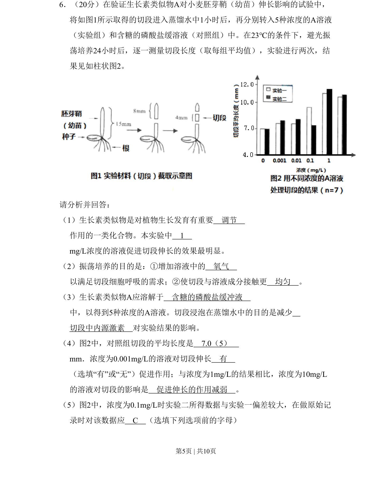
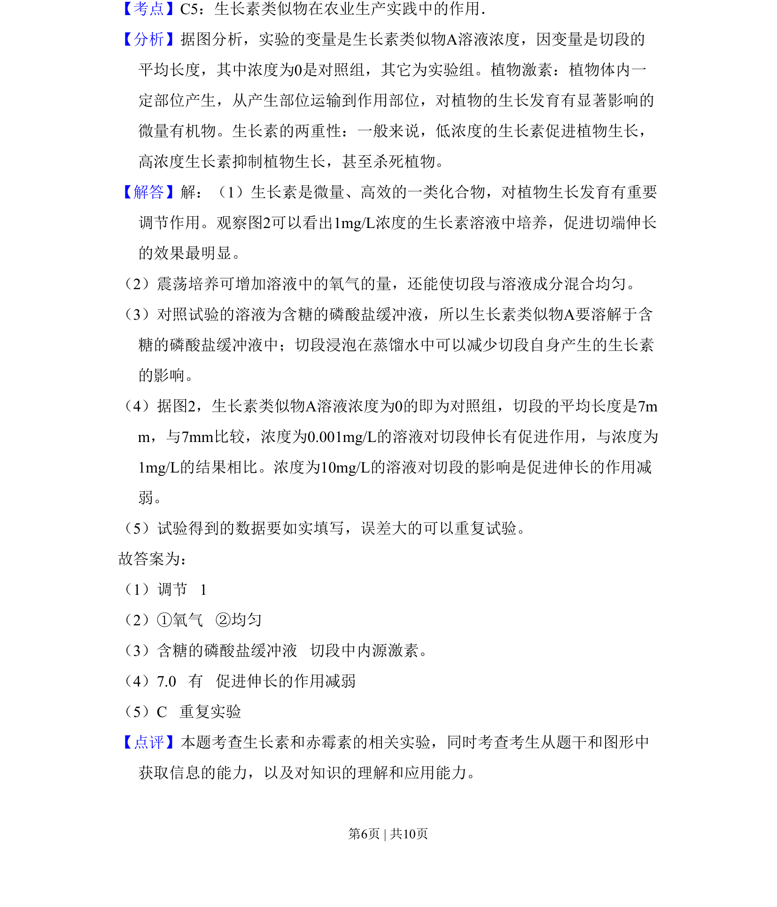

## 题面

## 摘要

本题考查生长素类似物对胚芽鞘伸长的实验设计与结果分析。

## 关联考点

- [[生长素类似物]]
- [[实验变量控制]]
- [[数据记录与处理]]

## 答案与解析

> 📄 原 PDF 第 5 页：`素材/真题/北京/2008-2024·（北京）生物高考真题/2010年高考生物试卷（北京）（解析卷）.pdf`

<!-- 题干文本-start -->
## 题干文本
6．（20分）在验证生长素类似物A对小麦胚芽鞘（幼苗）伸长影响的试验中，
将如图1所示取得的切段进入蒸馏水中1小时后，再分别转入5种浓度的A溶液
（实验组）和含糖的磷酸盐缓溶液（对照组）中。在23℃的条件下，避光振
荡培养24小时后，逐一测量切段长度（取每组平均值），实验进行两次，结
果见如柱状图2。
请分析并回答：
（1）生长素类似物是对植物生长发育有重要　调节　
作用的一类化合物。本实验中　1　
mg/L浓度的溶液促进切段伸长的效果最明显。
（2）振荡培养的目的是：①增加溶液中的　氧气　
以满足切段细胞呼吸的需求；②使切段与溶液成分接触更　均匀　。
（3）生长素类似物A应溶解于　含糖的磷酸盐缓冲液　
中，以得到5种浓度的A溶液。切段浸泡在蒸馏水中的目的是减少　
切段中内源激素　对实验结果的影响。
（4）图2中，对照组切段的平均长度是　7.0（5）　
mm．浓度为0.001mg/L的溶液对切段伸长　有　
（选填“有”或“无”）促进作用；与浓度为1mg/L的结果相比，浓度为10mg/L
的溶液对切段的影响是　促进伸长的作用减弱　。
（5）图2中，浓度为0.1mg/L时实验二所得数据与实验一偏差较大，在做原始记
录时对该数据应　C　（选填下列选项前的字母）
<!-- 题干文本-end -->

<!-- 解析文本-start -->
## 解析文本

<!-- 解析文本-end -->
