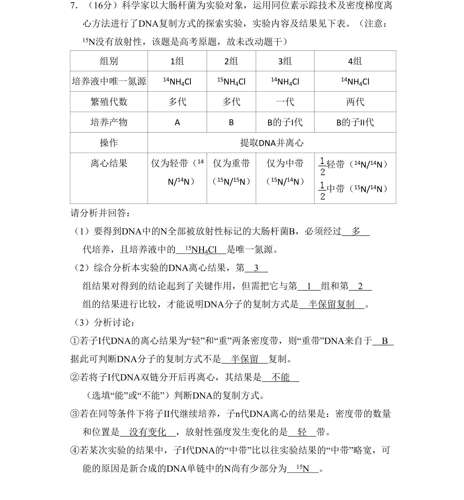
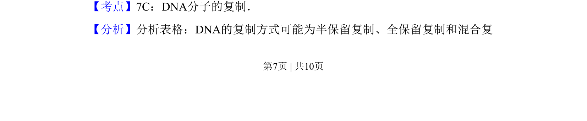
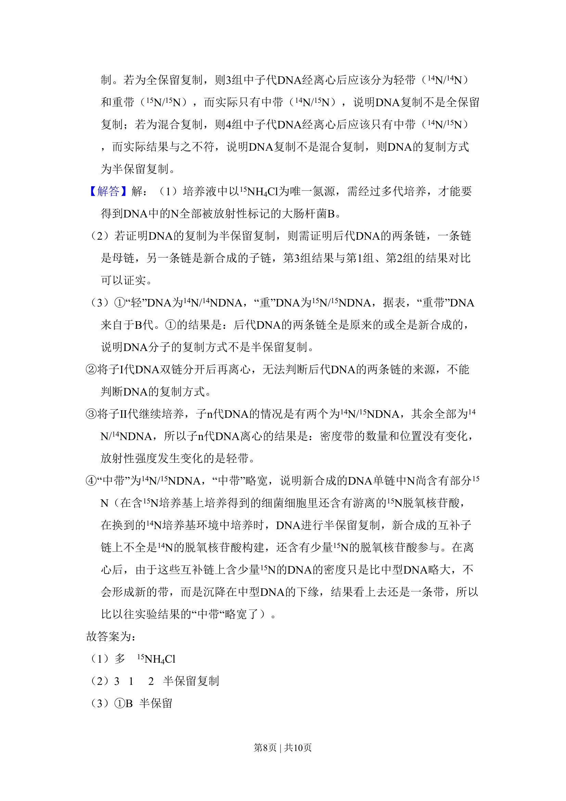
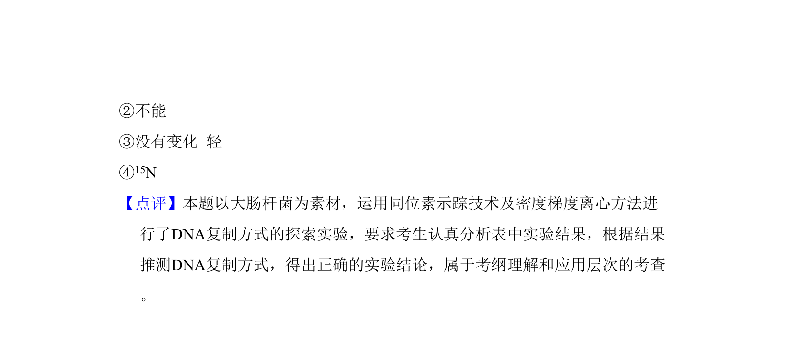

## 题面

## 摘要

探究大肠杆菌DNA复制方式，通过15N标记与密度梯度离心实验分析半保留复制原理。

## 关联考点

- [[285-DNA复制|DNA复制]]
- [[288-半保留复制|半保留复制]]
- [[888-同位素示踪|同位素示踪]]
- [[密度梯度离心]]

## 答案与解析

> 📄 原 PDF 第 7 页：`素材/真题/北京/2008-2024·（北京）生物高考真题/2010年高考生物试卷（北京）（解析卷）.pdf`
