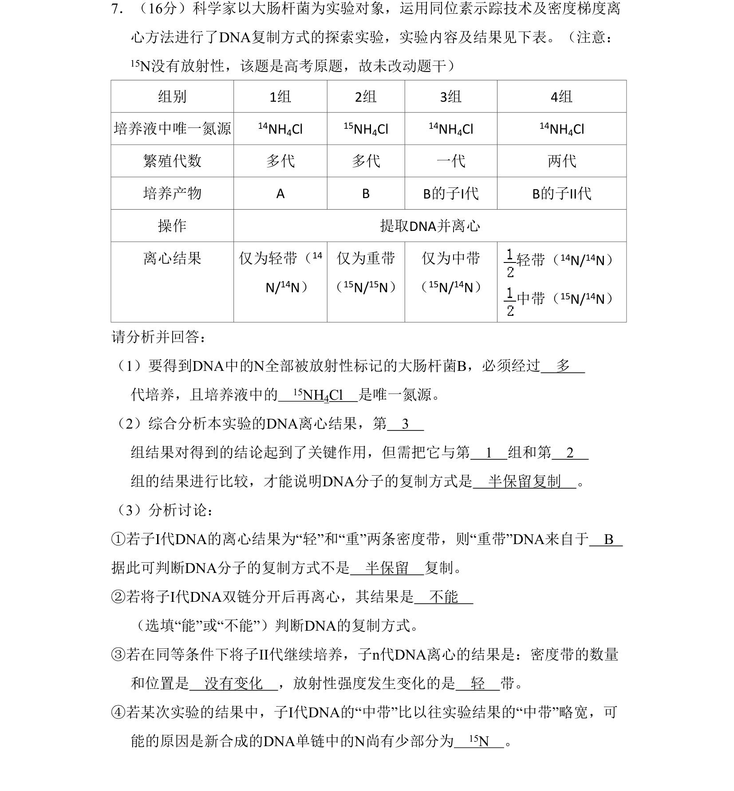
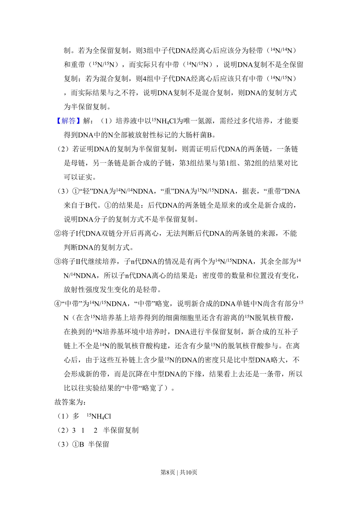
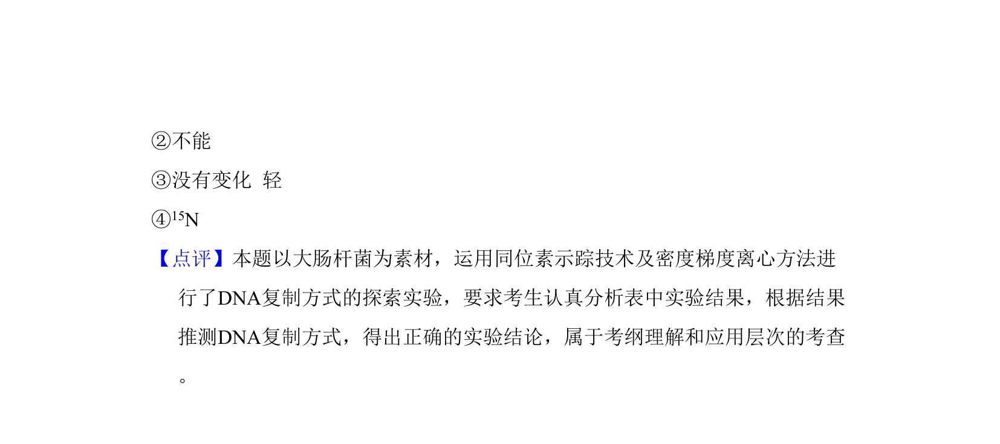

## 题面

## 摘要

探究大肠杆菌DNA复制方式，通过15N标记与密度梯度离心实验分析半保留复制原理。

## 关联考点

- [[285-DNA复制|DNA复制]]
- [[288-半保留复制|半保留复制]]
- [[888-同位素示踪|同位素示踪]]
- [[密度梯度离心]]

## 答案与解析

> 📄 原 PDF 第 7 页：`素材/真题/北京/2008-2024·（北京）生物高考真题/2010年高考生物试卷（北京）（解析卷）.pdf`

<!-- 题干文本-start -->
## 题干文本
7．（16分）科学家以大肠杆菌为实验对象，运用同位素示踪技术及密度梯度离
心方法进行了DNA复制方式的探索实验，实验内容及结果见下表。（注意：
15N没有放射性，该题是高考原题，故未改动题干）
组别 1组 2组 3组 4组
培养液中唯一氮源 14NH4Cl 15NH4Cl 14NH4Cl 14NH4Cl
繁殖代数 多代 多代 一代 两代
培养产物 A B B的子I代 B的子II代
操作 提取DNA并离心
离心结果 仅为轻带（14
N/14N）
仅为重带
（15N/15N）
仅为中带
（15N/14N）
轻带（14N/14N）
中带（15N/14N）
请分析并回答：
（1）要得到DNA中的N全部被放射性标记的大肠杆菌B，必须经过　多　
代培养，且培养液中的　15NH4Cl　是唯一氮源。
（2）综合分析本实验的DNA离心结果，第　3　
组结果对得到的结论起到了关键作用，但需把它与第　1　组和第　2　
组的结果进行比较，才能说明DNA分子的复制方式是　半保留复制　。
（3）分析讨论：
①若子I代DNA的离心结果为“轻”和“重”两条密度带，则“重带”DNA来自于　B　
据此可判断DNA分子的复制方式不是　半保留　复制。
②若将子I代DNA双链分开后再离心，其结果是　不能　
（选填“能”或“不能”）判断DNA的复制方式。
③若在同等条件下将子II代继续培养，子n代DNA离心的结果是：密度带的数量
和位置是　没有变化　，放射性强度发生变化的是　轻　带。
④若某次实验的结果中，子I代DNA的“中带”比以往实验结果的“中带”略宽，可
能的原因是新合成的DNA单链中的N尚有少部分为　15N　。
<!-- 题干文本-end -->

<!-- 解析文本-start -->
## 解析文本
【考点】7C：DNA分子的复制．菁优网版权所有
【分析】分析表格：DNA的复制方式可能为半保留复制、全保留复制和混合复
<!-- 解析文本-end -->
