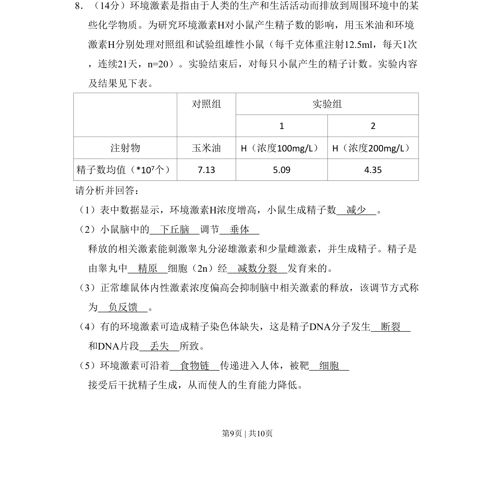
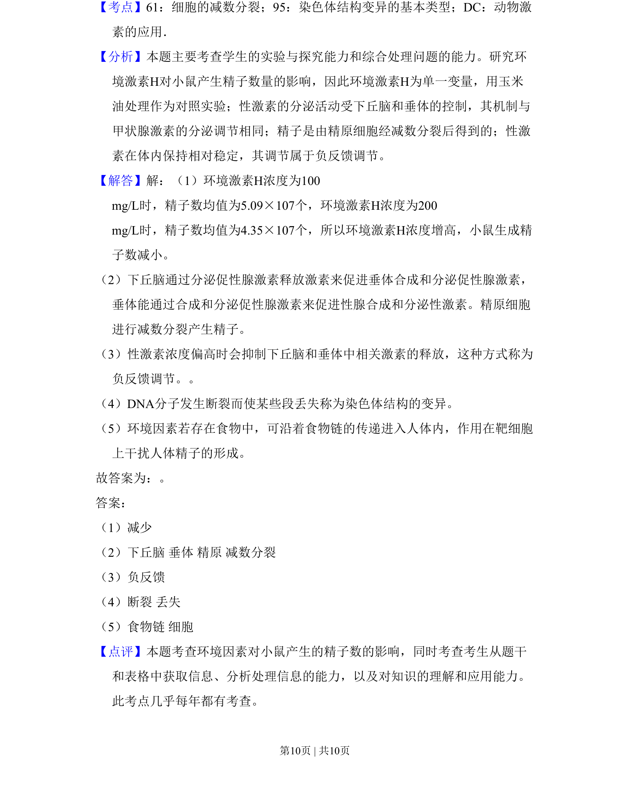

## 题面

## 摘要

研究环境激素H对小鼠精子数的影响，实验分析、激素调节与遗传变异。

## 关联考点

- [[环境激素]]
- [[负反馈调节]]
- [[277-减数分裂（高中必二）|减数分裂]]
- [[DNA损伤]]

## 答案与解析

> 📄 原 PDF 第 9 页：`素材/真题/北京/2008-2024·（北京）生物高考真题/2010年高考生物试卷（北京）（解析卷）.pdf`
