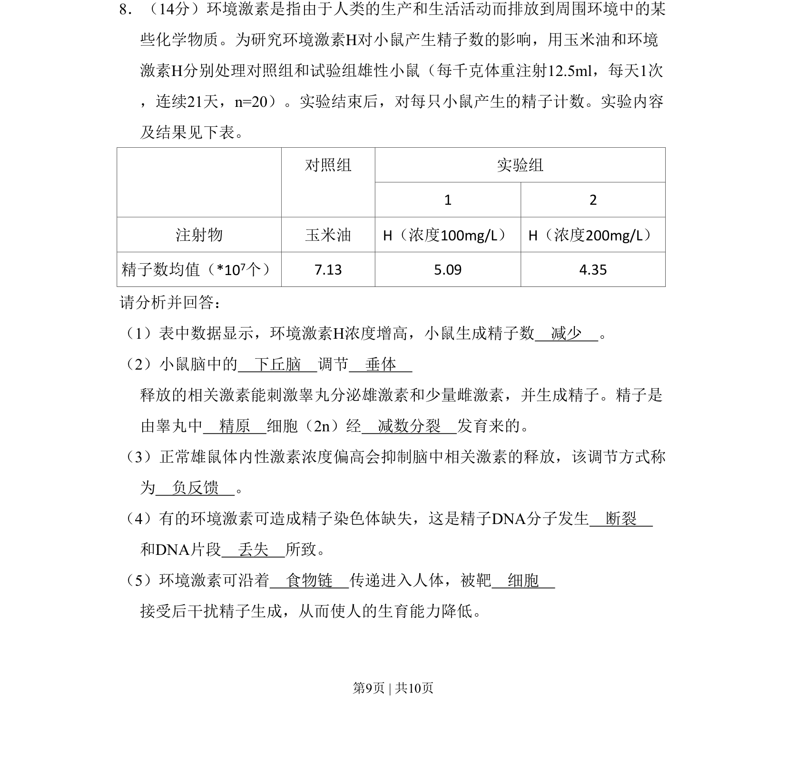
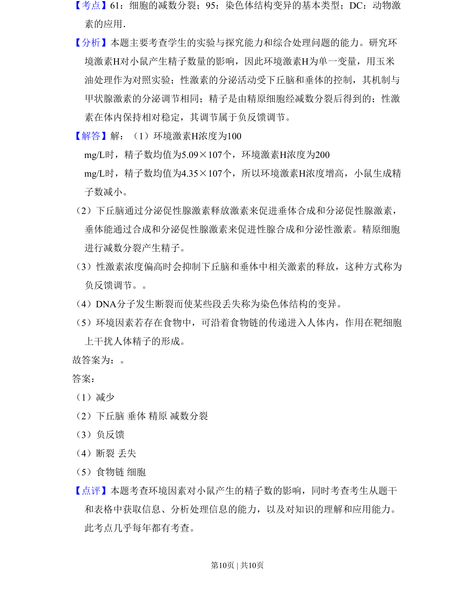

## 题面

## 摘要

研究环境激素H对小鼠精子数的影响，实验分析、激素调节与遗传变异。

## 关联考点

- [[环境激素]]
- [[909-负反馈调节|负反馈调节]]
- [[277-减数分裂（高中必二）|减数分裂]]
- [[DNA损伤]]

## 答案与解析

> 📄 原 PDF 第 9 页：`素材/真题/北京/2008-2024·（北京）生物高考真题/2010年高考生物试卷（北京）（解析卷）.pdf`

<!-- 题干文本-start -->
## 题干文本
8．（14分）环境激素是指由于人类的生产和生活活动而排放到周围环境中的某
些化学物质。为研究环境激素H对小鼠产生精子数的影响，用玉米油和环境
激素H分别处理对照组和试验组雄性小鼠（每千克体重注射12.5ml，每天1次
，连续21天，n=20）。实验结束后，对每只小鼠产生的精子计数。实验内容
及结果见下表。
实验组对照组
1 2
注射物 玉米油 H（浓度100mg/L） H（浓度200mg/L）
精子数均值（*107个） 7.13 5.09 4.35
请分析并回答：
（1）表中数据显示，环境激素H浓度增高，小鼠生成精子数　减少　。
（2）小鼠脑中的　下丘脑　调节　垂体　
释放的相关激素能刺激睾丸分泌雄激素和少量雌激素，并生成精子。精子是
由睾丸中　精原　细胞（2n）经　减数分裂　发育来的。
（3）正常雄鼠体内性激素浓度偏高会抑制脑中相关激素的释放，该调节方式称
为　负反馈　。
（4）有的环境激素可造成精子染色体缺失，这是精子DNA分子发生　断裂　
和DNA片段　丢失　所致。
（5）环境激素可沿着　食物链　传递进入人体，被靶　细胞　
接受后干扰精子生成，从而使人的生育能力降低。
<!-- 题干文本-end -->

<!-- 解析文本-start -->
## 解析文本

<!-- 解析文本-end -->
