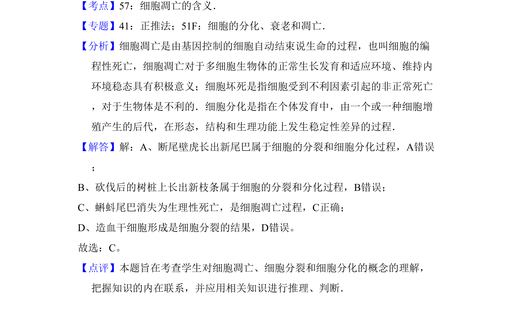

## 题面

## 摘要

该题考查细胞凋亡与细胞增殖、分化的区别，要求判断生理性死亡实例。

## 关联考点

- [[250-细胞凋亡|细胞凋亡]]
- [[046-细胞分裂|细胞分裂]]
- [[045-细胞分化|细胞分化]]

## 答案与解析

> 📄 原 PDF 第 1 页：`素材/真题/北京/2008-2024·（北京）生物高考真题/2011年高考生物试卷（北京）（解析卷）.pdf`
