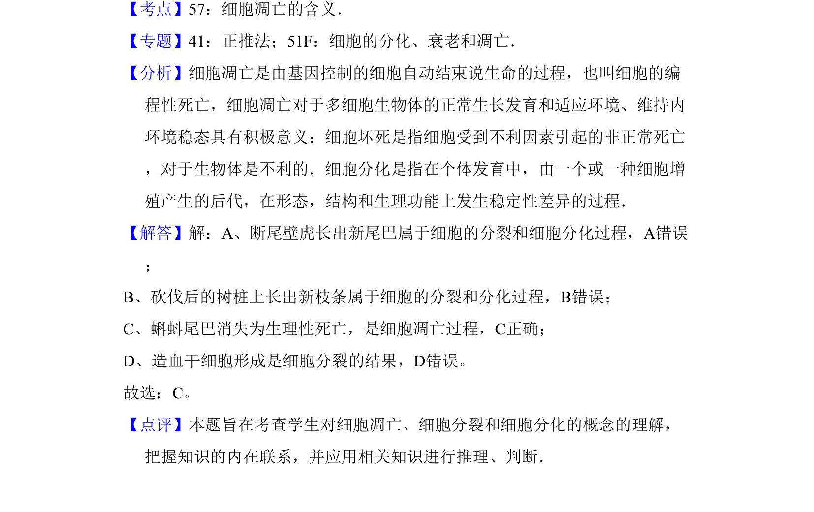

## 题面

## 摘要

该题考查细胞凋亡与细胞增殖、分化的区别，要求判断生理性死亡实例。

## 关联考点

- [[250-细胞凋亡|细胞凋亡]]
- [[046-细胞分裂|细胞分裂]]
- [[045-细胞分化|细胞分化]]

## 答案与解析

> 📄 原 PDF 第 1 页：`素材/真题/北京/2008-2024·（北京）生物高考真题/2011年高考生物试卷（北京）（解析卷）.pdf`

<!-- 题干文本-start -->
## 题干文本
1．（6分）下列生命过程中，有细胞凋亡过程的是（　　）
A．断尾壁虎长出新尾巴B．砍伐后的树桩上长出新枝条
C．蝌蚪尾巴消失的过程D．胚胎发育中出现造血干细胞
<!-- 题干文本-end -->

<!-- 解析文本-start -->
## 解析文本
【考点】57：细胞凋亡的含义．菁优网版权所有
【专题】41：正推法；51F：细胞的分化、衰老和凋亡．
【分析】细胞凋亡是由基因控制的细胞自动结束说生命的过程，也叫细胞的编
程性死亡，细胞凋亡对于多细胞生物体的正常生长发育和适应环境、维持内
环境稳态具有积极意义；细胞坏死是指细胞受到不利因素引起的非正常死亡
，对于生物体是不利的．细胞分化是指在个体发育中，由一个或一种细胞增
殖产生的后代，在形态，结构和生理功能上发生稳定性差异的过程．
【解答】解：A、断尾壁虎长出新尾巴属于细胞的分裂和细胞分化过程，A错误
；
B、砍伐后的树桩上长出新枝条属于细胞的分裂和分化过程，B错误；
C、蝌蚪尾巴消失为生理性死亡，是细胞凋亡过程，C正确；
D、造血干细胞形成是细胞分裂的结果，D错误。
故选：C。
【点评】本题旨在考查学生对细胞凋亡、细胞分裂和细胞分化的概念的理解，
把握知识的内在联系，并应用相关知识进行推理、判断．
<!-- 解析文本-end -->
