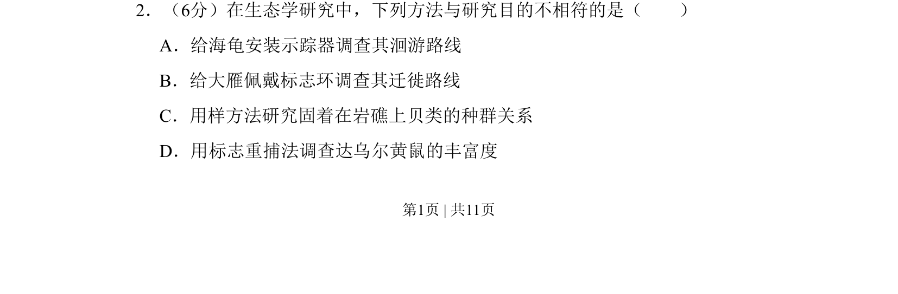
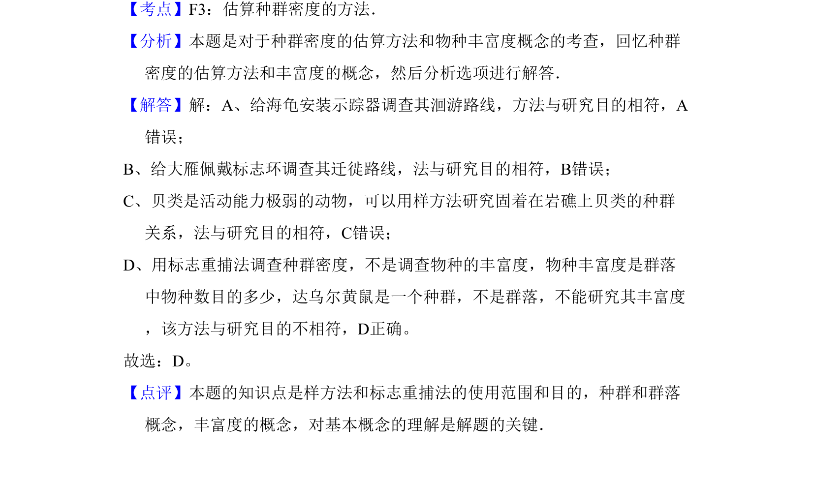

## 题面

## 摘要

本题考查生态学研究方法的正确选择，需判断方法与目的匹配性。

## 关联考点

- [[366-样方法|样方法]]
- [[365-标志重捕法|标志重捕法]]
- [[370-种群密度|种群密度]]
- [[632-物种丰富度|物种丰富度]]

## 答案与解析

> 📄 原 PDF 第 1 页：`素材/真题/北京/2008-2024·（北京）生物高考真题/2011年高考生物试卷（北京）（解析卷）.pdf`
