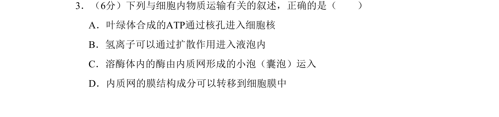
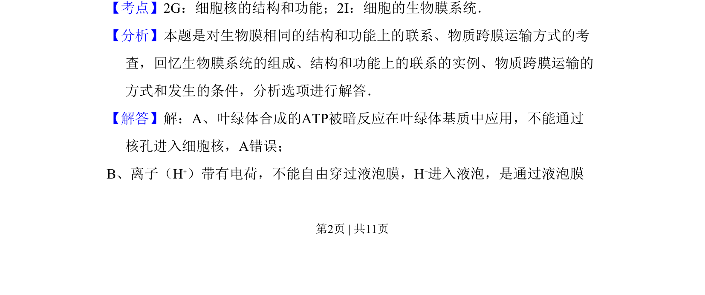
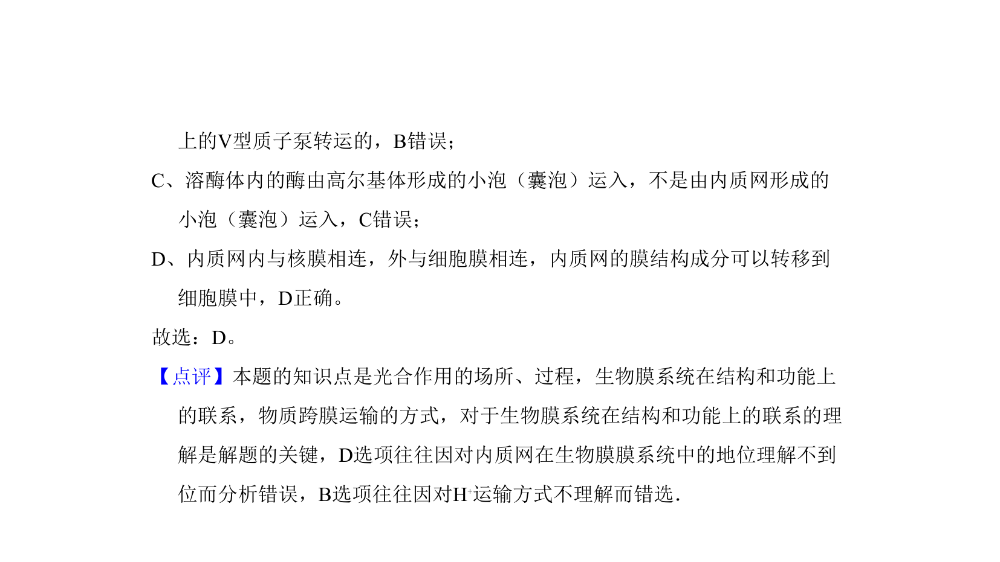

## 题面

## 摘要

本题判断细胞内物质运输叙述正误，涉及ATP运输、离子跨膜、溶酶体酶转运及膜成分转移。

## 关联考点

- [[细胞核结构与功能]]
- [[227-生物膜系统|生物膜系统]]
- [[635-物质跨膜运输|物质跨膜运输]]

## 答案与解析

> 📄 原 PDF 第 2 页：`素材/真题/北京/2008-2024·（北京）生物高考真题/2011年高考生物试卷（北京）（解析卷）.pdf`
