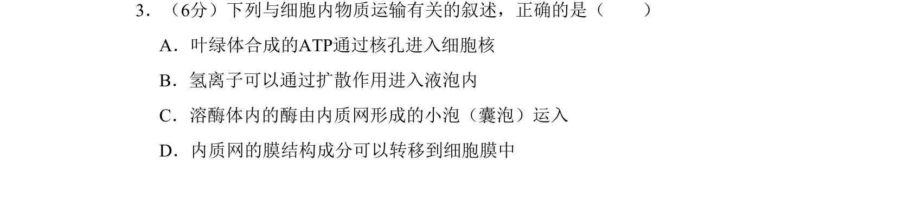
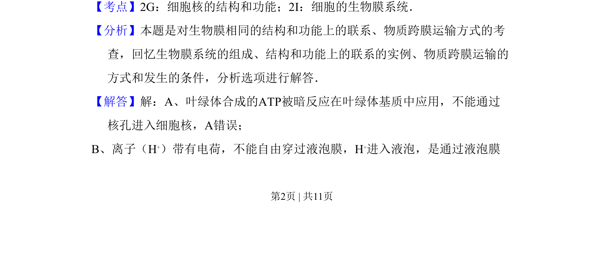
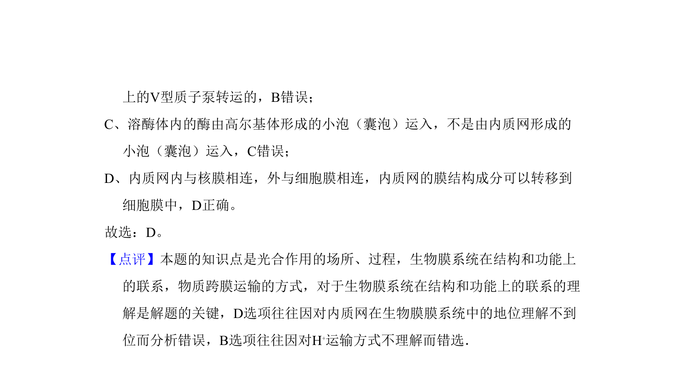

## 题面

## 摘要

本题判断细胞内物质运输叙述正误，涉及ATP运输、离子跨膜、溶酶体酶转运及膜成分转移。

## 关联考点

- [[细胞核结构与功能]]
- [[227-生物膜系统|生物膜系统]]
- [[635-物质跨膜运输|物质跨膜运输]]

## 答案与解析

> 📄 原 PDF 第 2 页：`素材/真题/北京/2008-2024·（北京）生物高考真题/2011年高考生物试卷（北京）（解析卷）.pdf`

<!-- 题干文本-start -->
## 题干文本
3．（6分）下列与细胞内物质运输有关的叙述，正确的是（　　）
A．叶绿体合成的ATP通过核孔进入细胞核
B．氢离子可以通过扩散作用进入液泡内
C．溶酶体内的酶由内质网形成的小泡（囊泡）运入
D．内质网的膜结构成分可以转移到细胞膜中
<!-- 题干文本-end -->

<!-- 解析文本-start -->
## 解析文本
【考点】2G：细胞核的结构和功能；2I：细胞的生物膜系统．菁优网版权所有
【分析】本题是对生物膜相同的结构和功能上的联系、物质跨膜运输方式的考
查，回忆生物膜系统的组成、结构和功能上的联系的实例、物质跨膜运输的
方式和发生的条件，分析选项进行解答．
【解答】解：A、叶绿体合成的ATP被暗反应在叶绿体基质中应用，不能通过
核孔进入细胞核，A错误；
B、离子（H+）带有电荷，不能自由穿过液泡膜，H+进入液泡，是通过液泡膜
<!-- 解析文本-end -->
