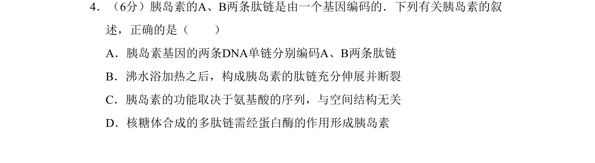
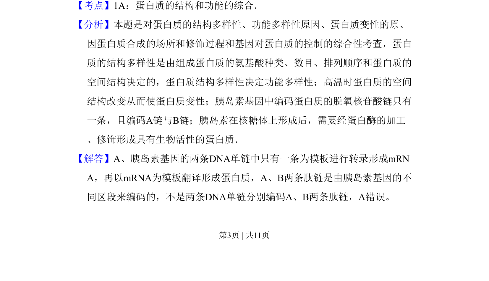
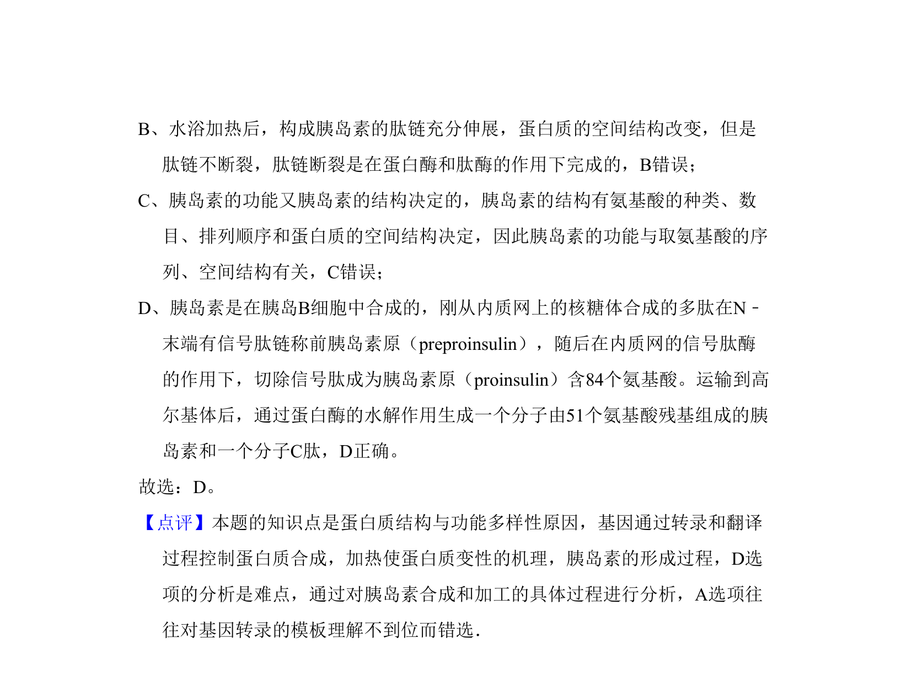

## 题面

## 摘要

本题通过胰岛素实例考查基因编码、蛋白质结构与功能及合成加工过程。

## 关联考点

- [[699-蛋白质结构多样性|蛋白质结构多样性]]
- [[479-基因表达|基因表达]]
- [[蛋白质变性]]
- [[蛋白酶加工]]

## 答案与解析

> 📄 原 PDF 第 3 页：`素材/真题/北京/2008-2024·（北京）生物高考真题/2011年高考生物试卷（北京）（解析卷）.pdf`
