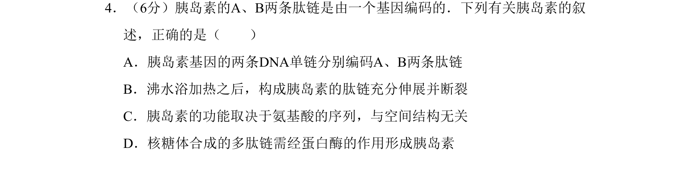
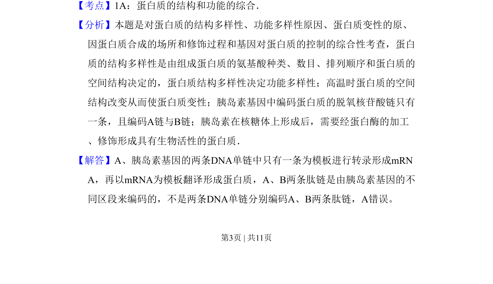
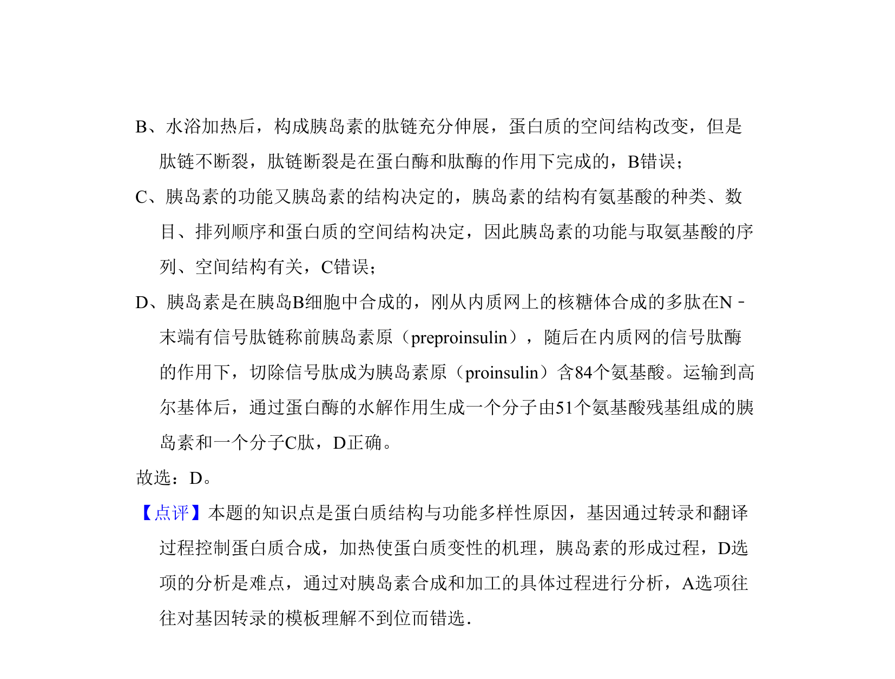

## 题面

## 摘要

本题通过胰岛素实例考查基因编码、蛋白质结构与功能及合成加工过程。

## 关联考点

- [[699-蛋白质结构多样性|蛋白质结构多样性]]
- [[843-基因的表达|基因表达]]
- [[蛋白质变性]]
- [[蛋白酶加工]]

## 答案与解析

> 📄 原 PDF 第 3 页：`素材/真题/北京/2008-2024·（北京）生物高考真题/2011年高考生物试卷（北京）（解析卷）.pdf`

<!-- 题干文本-start -->
## 题干文本
4．（6分）胰岛素的A、B两条肽链是由一个基因编码的．下列有关胰岛素的叙
述，正确的是（　　）
A．胰岛素基因的两条DNA单链分别编码A、B两条肽链
B．沸水浴加热之后，构成胰岛素的肽链充分伸展并断裂
C．胰岛素的功能取决于氨基酸的序列，与空间结构无关
D．核糖体合成的多肽链需经蛋白酶的作用形成胰岛素
<!-- 题干文本-end -->

<!-- 解析文本-start -->
## 解析文本
【考点】1A：蛋白质的结构和功能的综合．菁优网版权所有
【分析】本题是对蛋白质的结构多样性、功能多样性原因、蛋白质变性的原、
因蛋白质合成的场所和修饰过程和基因对蛋白质的控制的综合性考查，蛋白
质的结构多样性是由组成蛋白质的氨基酸种类、数目、排列顺序和蛋白质的
空间结构决定的，蛋白质结构多样性决定功能多样性；高温时蛋白质的空间
结构改变从而使蛋白质变性；胰岛素基因中编码蛋白质的脱氧核苷酸链只有
一条，且编码A链与B链；胰岛素在核糖体上形成后，需要经蛋白酶的加工
、修饰形成具有生物活性的蛋白质．
【解答】A、胰岛素基因的两条DNA单链中只有一条为模板进行转录形成mRN
A，再以mRNA为模板翻译形成蛋白质，A、B两条肽链是由胰岛素基因的不
同区段来编码的，不是两条DNA单链分别编码A、B两条肽链，A错误。
<!-- 解析文本-end -->
