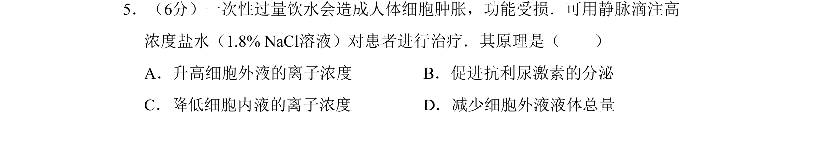
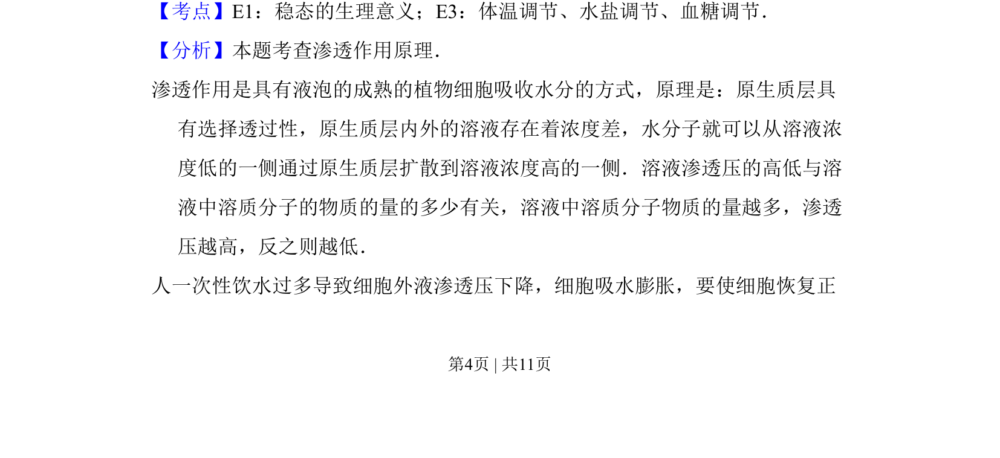
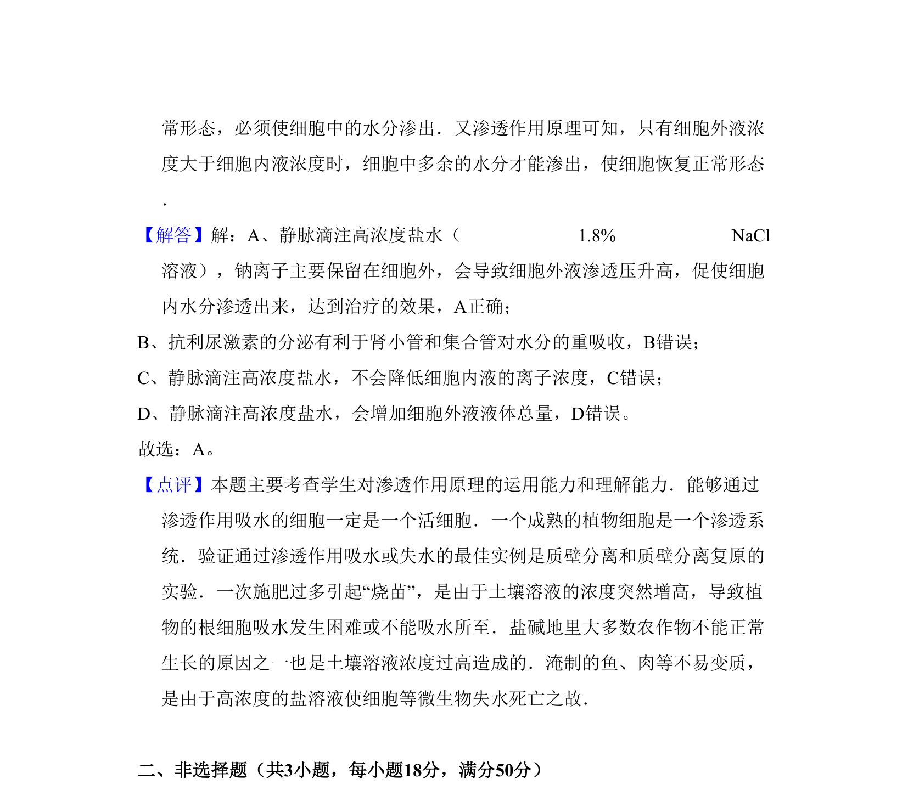

## 题面

## 摘要

一次性过量饮水导致细胞肿胀，用高浓度盐水治疗，原理是升高细胞外液离子浓度以恢复渗透压。

## 关联考点

- [[314-内环境稳态|稳态]]
- [[740-水盐平衡|水盐调节]]
- [[497-渗透压|渗透压]]
- [[313-内环境|内环境]]

## 答案与解析

> 📄 原 PDF 第 4 页：`素材/真题/北京/2008-2024·（北京）生物高考真题/2011年高考生物试卷（北京）（解析卷）.pdf`
