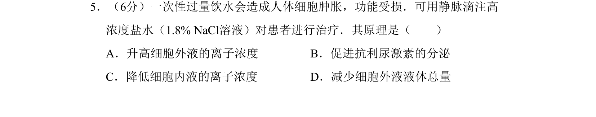
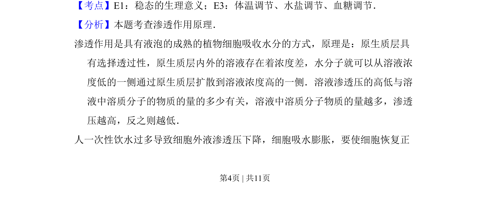
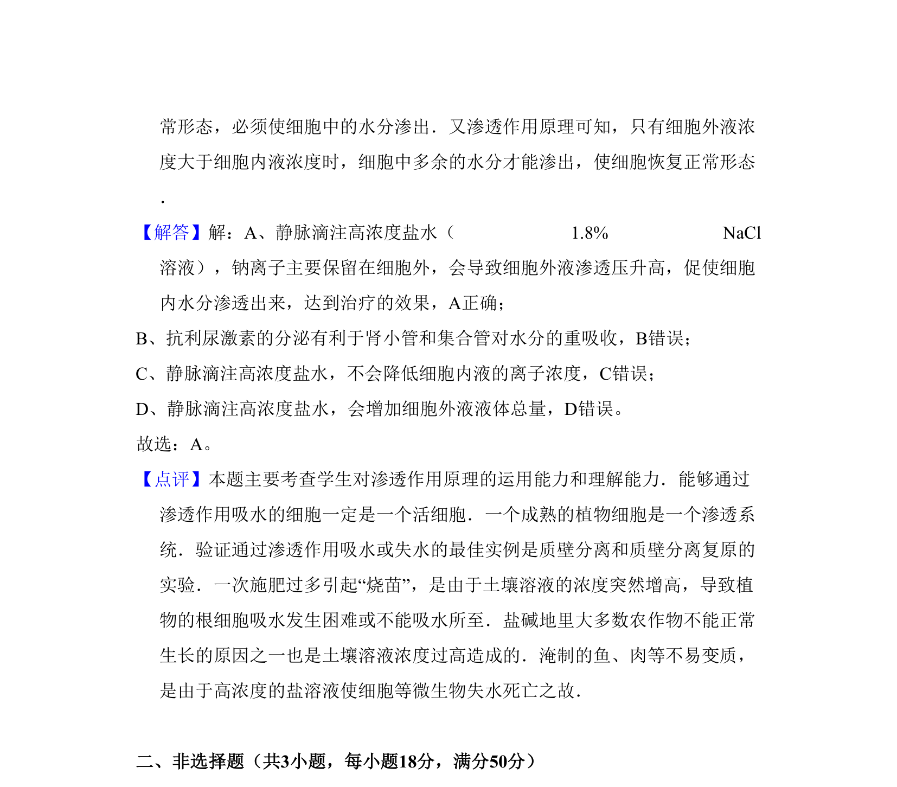

## 题面

## 摘要

一次性过量饮水导致细胞肿胀，用高浓度盐水治疗，原理是升高细胞外液离子浓度以恢复渗透压。

## 关联考点

- [[314-内环境稳态|稳态]]
- [[740-水盐平衡|水盐调节]]
- [[497-渗透压|渗透压]]
- [[313-内环境|内环境]]

## 答案与解析

> 📄 原 PDF 第 4 页：`素材/真题/北京/2008-2024·（北京）生物高考真题/2011年高考生物试卷（北京）（解析卷）.pdf`

<!-- 题干文本-start -->
## 题干文本
5．（6分）一次性过量饮水会造成人体细胞肿胀，功能受损．可用静脉滴注高
浓度盐水（1.8% NaCl溶液）对患者进行治疗．其原理是（　　）
A．升高细胞外液的离子浓度B．促进抗利尿激素的分泌
C．降低细胞内液的离子浓度D．减少细胞外液液体总量
<!-- 题干文本-end -->

<!-- 解析文本-start -->
## 解析文本
【考点】E1：稳态的生理意义；E3：体温调节、水盐调节、血糖调节．菁优网版权所有
【分析】本题考查渗透作用原理．
渗透作用是具有液泡的成熟的植物细胞吸收水分的方式，原理是：原生质层具
有选择透过性，原生质层内外的溶液存在着浓度差，水分子就可以从溶液浓
度低的一侧通过原生质层扩散到溶液浓度高的一侧．溶液渗透压的高低与溶
液中溶质分子的物质的量的多少有关，溶液中溶质分子物质的量越多，渗透
压越高，反之则越低．
人一次性饮水过多导致细胞外液渗透压下降，细胞吸水膨胀，要使细胞恢复正
<!-- 解析文本-end -->
