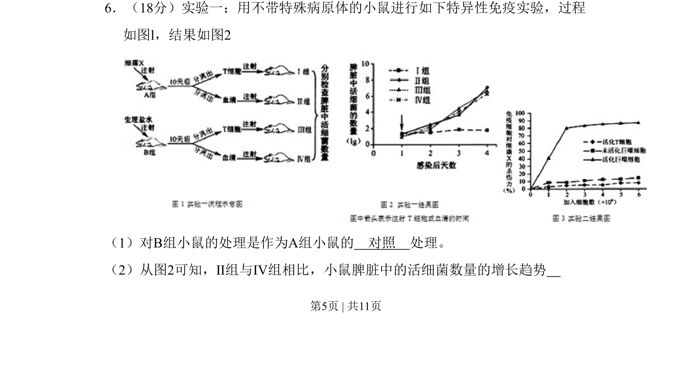
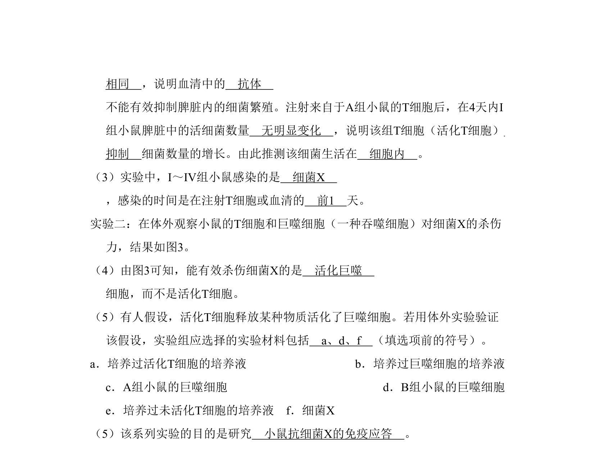
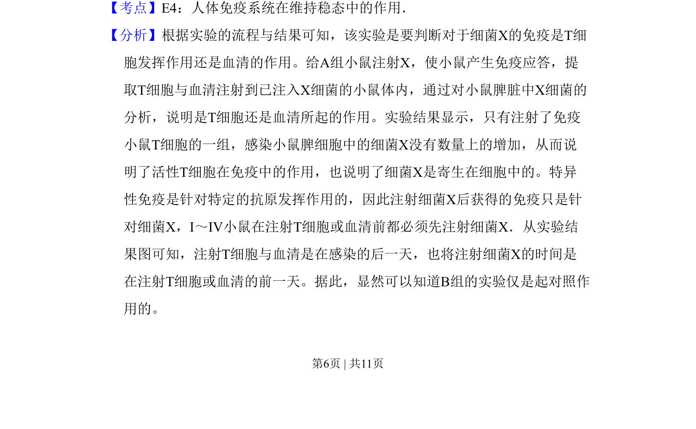
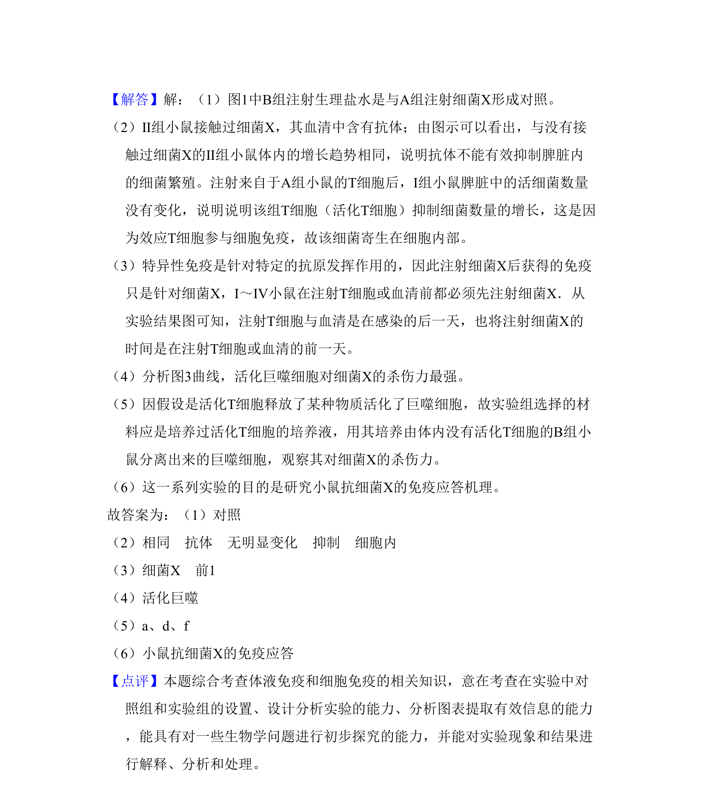

## 题面

## 摘要

本题通过小鼠免疫实验考查对照原则和免疫反应结果分析

## 关联考点

- [[637-特异性免疫|特异性免疫]]
- [[485-对照实验|对照实验]]

## 答案与解析

> 📄 原 PDF 第 5 页：`素材/真题/北京/2008-2024·（北京）生物高考真题/2011年高考生物试卷（北京）（解析卷）.pdf`

<!-- 题干文本-start -->
## 题干文本
6．（18分）实验一：用不带特殊病原体的小鼠进行如下特异性免疫实验，过程
如图l，结果如图2
（1）对B组小鼠的处理是作为A组小鼠的　对照　处理。
（2）从图2可知，Ⅱ组与Ⅳ组相比，小鼠脾脏中的活细菌数量的增长趋势
<!-- 题干文本-end -->

<!-- 解析文本-start -->
## 解析文本

<!-- 解析文本-end -->
