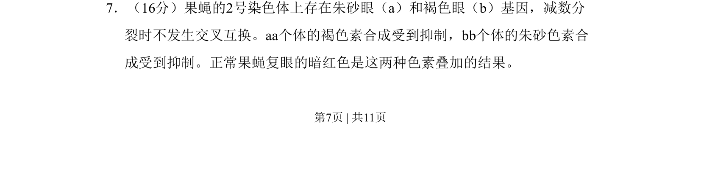
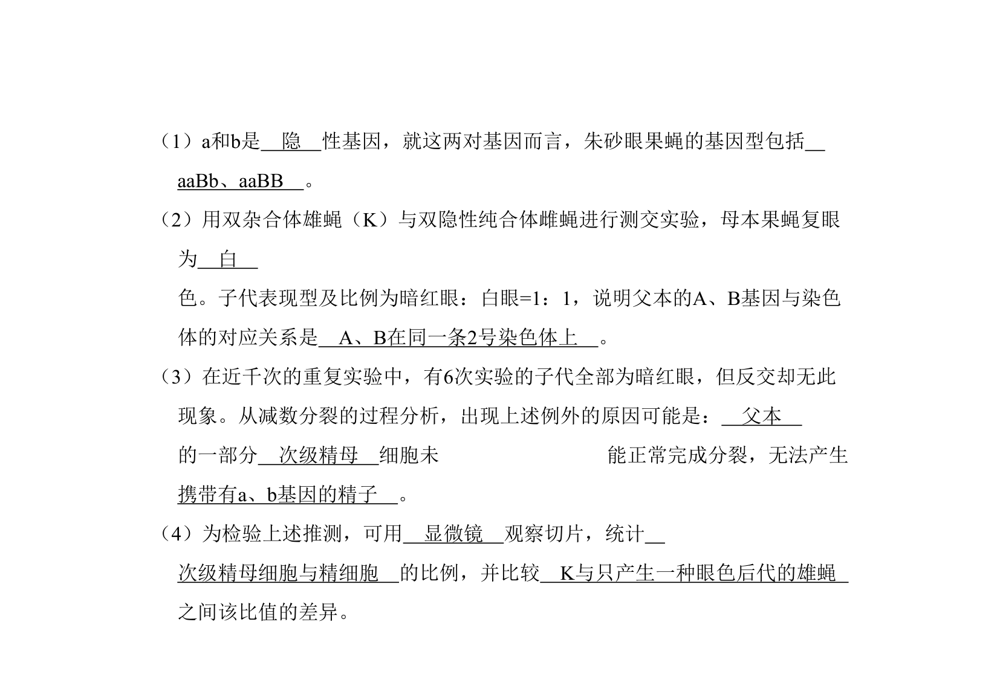
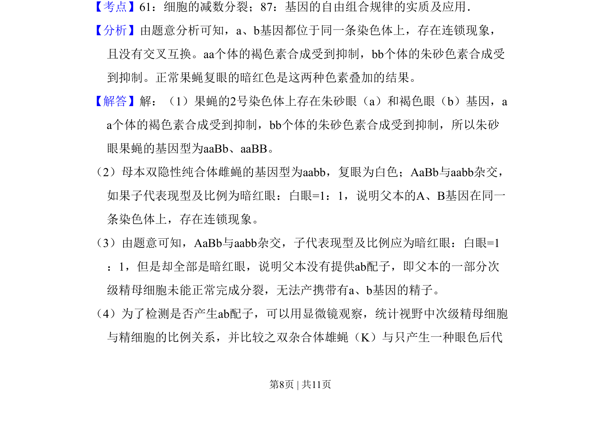
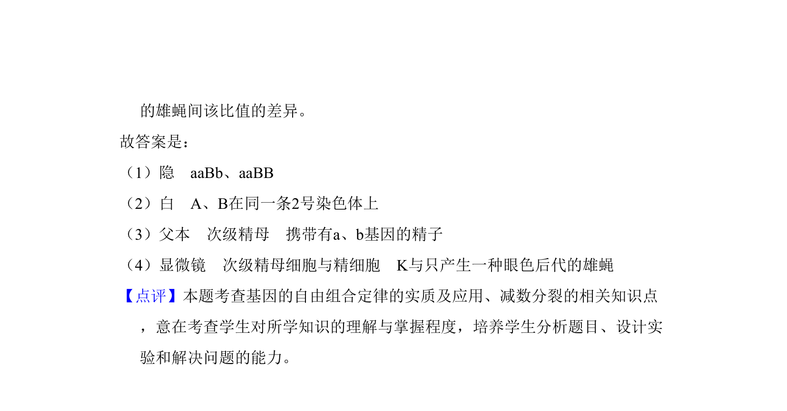

## 题面

## 摘要

果蝇眼色性状由两对等位基因控制且不连锁互换，涉及色素合成途径中基因互作与遗传分析

## 关联考点

- [[573-基因互作|基因互作]]
- [[连锁遗传]]
- [[色素合成]]
- [[果蝇遗传]]

## 答案与解析

> 📄 原 PDF 第 7 页：`素材/真题/北京/2008-2024·（北京）生物高考真题/2011年高考生物试卷（北京）（解析卷）.pdf`
