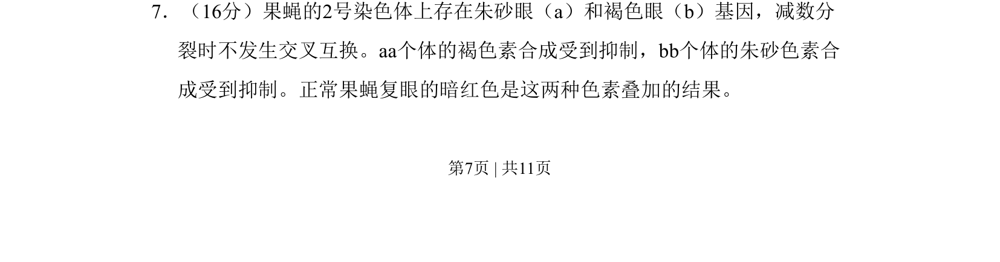
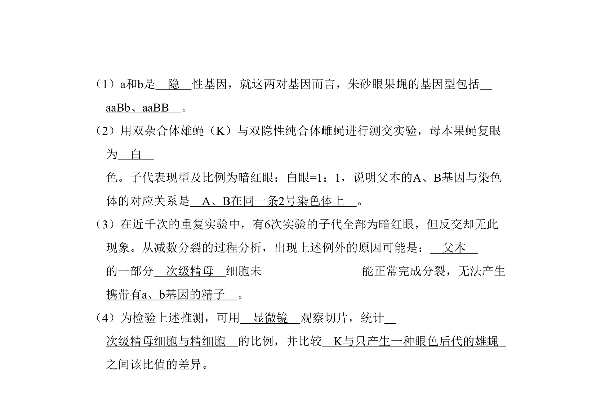
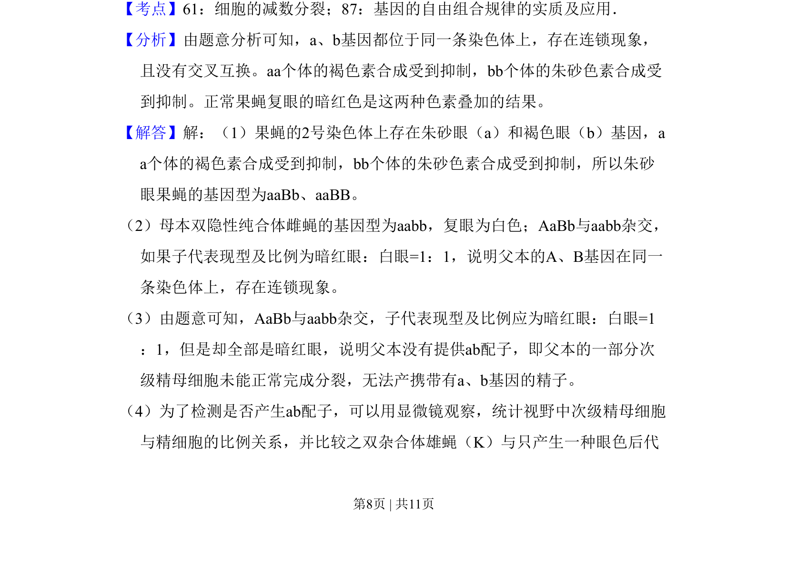
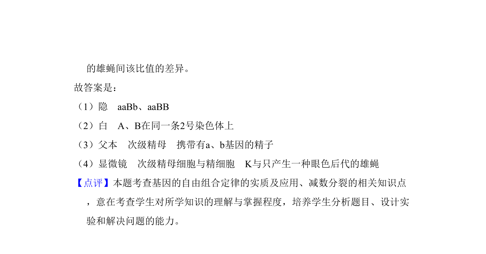

## 题面

## 摘要

果蝇眼色性状由两对等位基因控制且不连锁互换，涉及色素合成途径中基因互作与遗传分析

## 关联考点

- [[573-基因互作|基因互作]]
- [[连锁遗传]]
- [[色素合成]]
- [[果蝇遗传]]

## 答案与解析

> 📄 原 PDF 第 7 页：`素材/真题/北京/2008-2024·（北京）生物高考真题/2011年高考生物试卷（北京）（解析卷）.pdf`

<!-- 题干文本-start -->
## 题干文本
7．（16分）果蝇的2号染色体上存在朱砂眼（a）和褐色眼（b）基因，减数分
裂时不发生交叉互换。aa个体的褐色素合成受到抑制，bb个体的朱砂色素合
成受到抑制。正常果蝇复眼的暗红色是这两种色素叠加的结果。
<!-- 题干文本-end -->

<!-- 解析文本-start -->
## 解析文本

<!-- 解析文本-end -->
