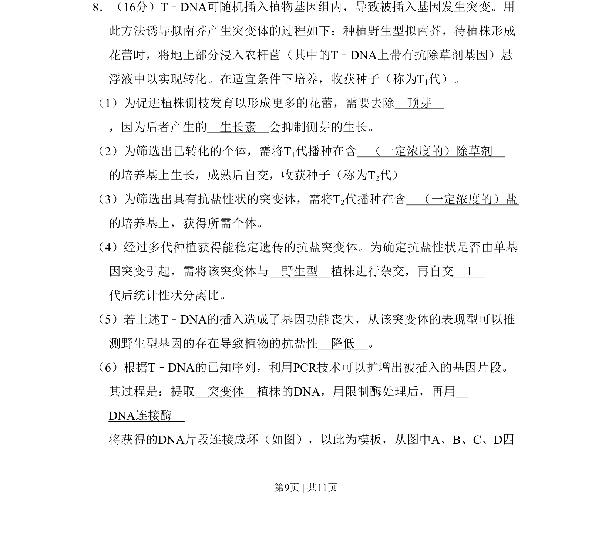
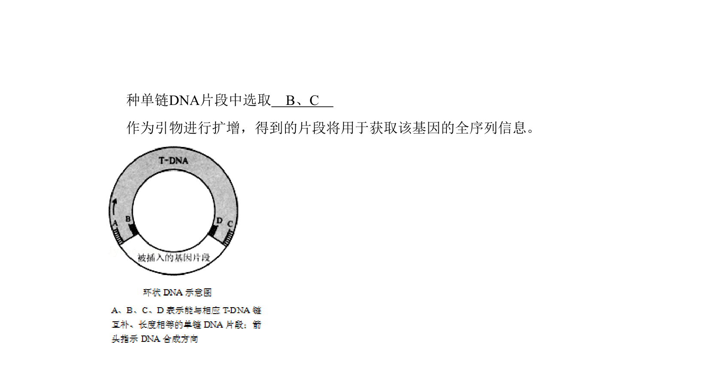
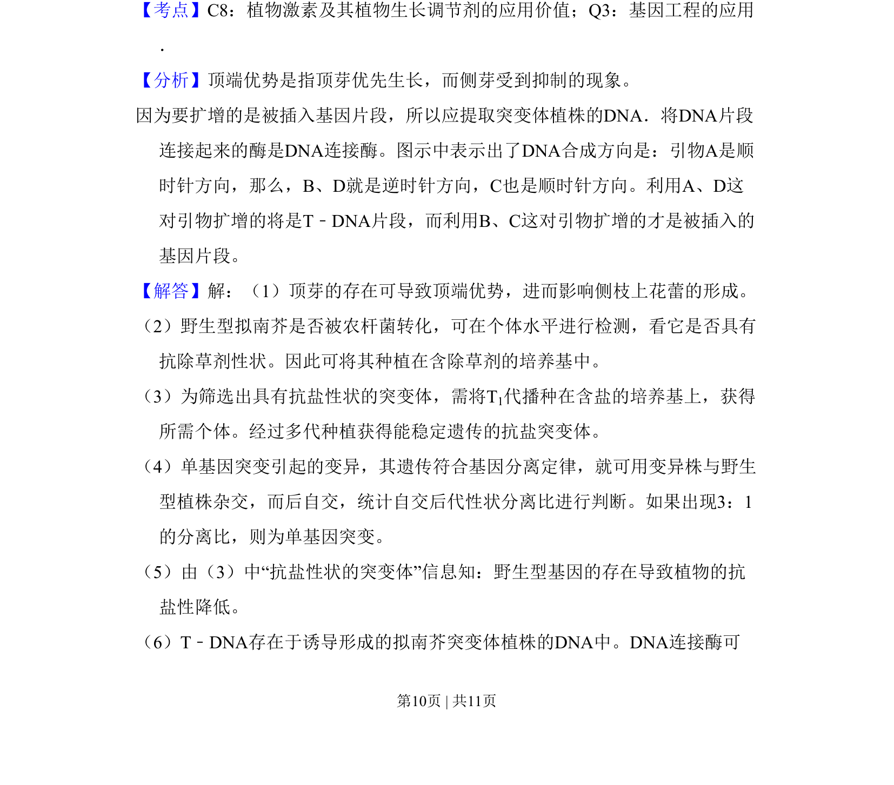
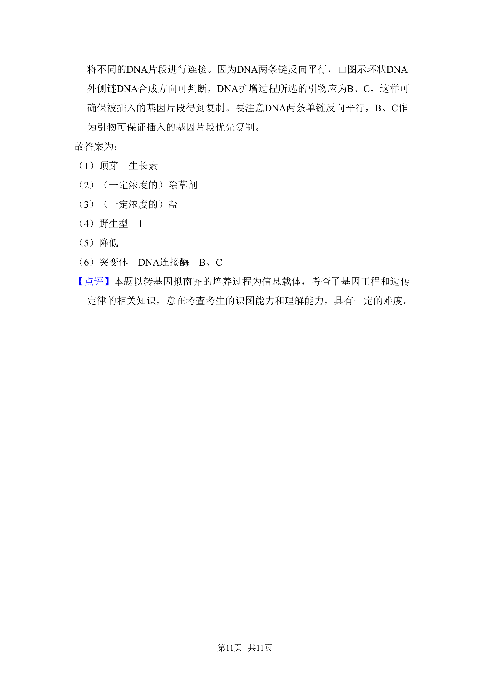

## 题面

## 摘要

该题考查T-DNA插入突变体的诱导、筛选及遗传分析，涉及植物激素、遗传杂交与分子生物学技术。

## 关联考点

- [[生长素与顶端优势]]
- [[301-基因突变|基因突变]]
- [[遗传杂交与性状分离]]
- [[抗性筛选]]

## 答案与解析

> 📄 原 PDF 第 9 页：`素材/真题/北京/2008-2024·（北京）生物高考真题/2011年高考生物试卷（北京）（解析卷）.pdf`
