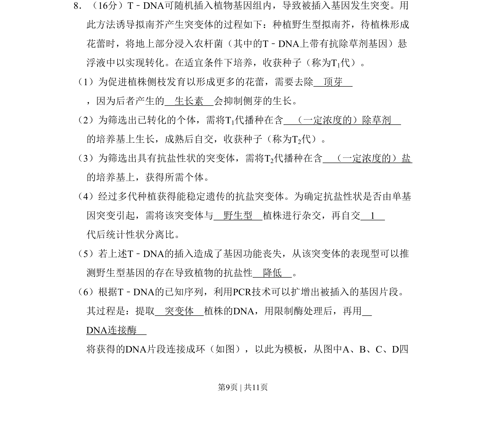
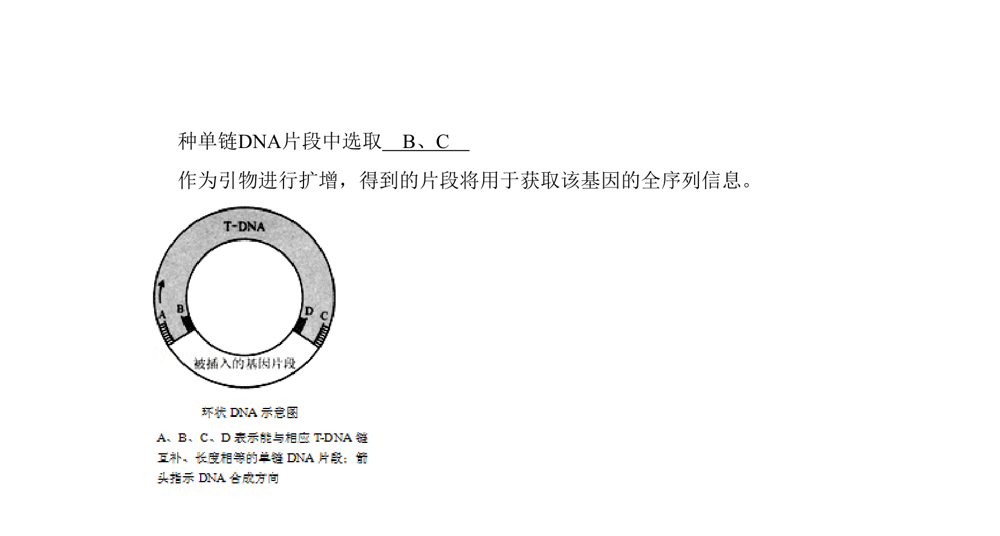
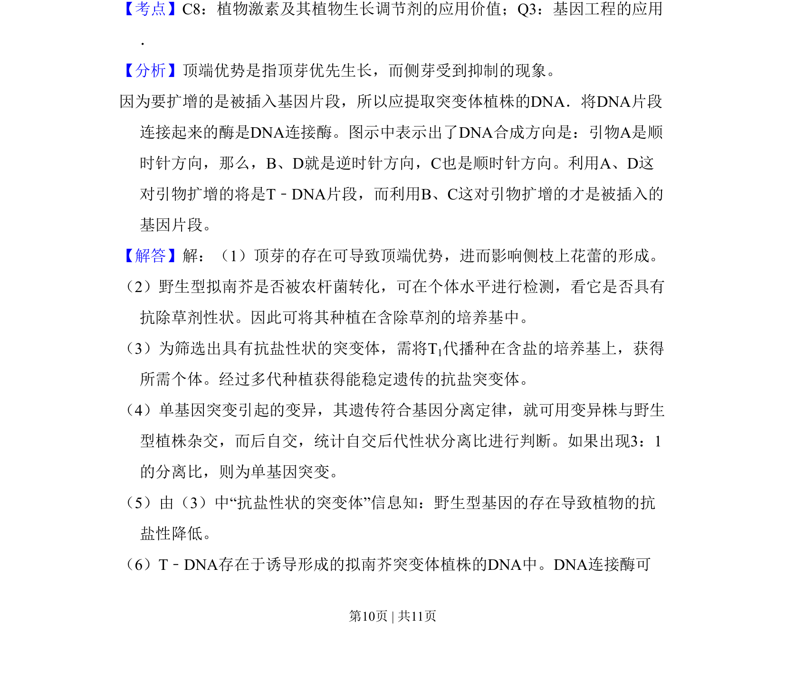
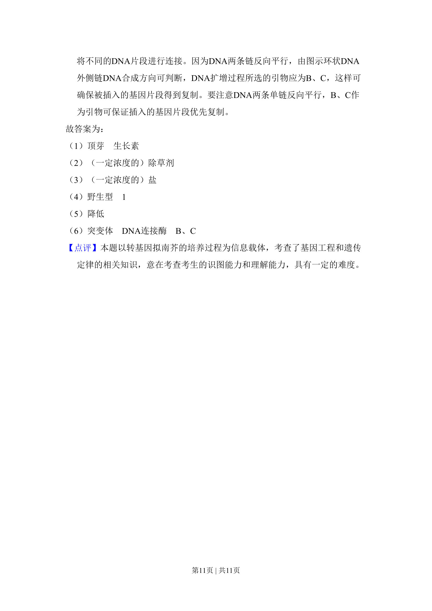

## 题面

## 摘要

该题考查T-DNA插入突变体的诱导、筛选及遗传分析，涉及植物激素、遗传杂交与分子生物学技术。

## 关联考点

- [[生长素与顶端优势]]
- [[301-基因突变|基因突变]]
- [[遗传杂交与性状分离]]
- [[抗性筛选]]

## 答案与解析

> 📄 原 PDF 第 9 页：`素材/真题/北京/2008-2024·（北京）生物高考真题/2011年高考生物试卷（北京）（解析卷）.pdf`

<!-- 题干文本-start -->
## 题干文本
8．（16分）T﹣DNA可随机插入植物基因组内，导致被插入基因发生突变。用
此方法诱导拟南芥产生突变体的过程如下：种植野生型拟南芥，待植株形成
花蕾时，将地上部分浸入农杆菌（其中的T﹣DNA上带有抗除草剂基因）悬
浮液中以实现转化。在适宜条件下培养，收获种子（称为T1代）。
（1）为促进植株侧枝发育以形成更多的花蕾，需要去除　顶芽　
，因为后者产生的　生长素　会抑制侧芽的生长。
（2）为筛选出已转化的个体，需将T1代播种在含　（一定浓度的）除草剂　
的培养基上生长，成熟后自交，收获种子（称为T2代）。
（3）为筛选出具有抗盐性状的突变体，需将T2代播种在含　（一定浓度的）盐　
的培养基上，获得所需个体。
（4）经过多代种植获得能稳定遗传的抗盐突变体。为确定抗盐性状是否由单基
因突变引起，需将该突变体与　野生型　植株进行杂交，再自交　1　
代后统计性状分离比。
（5）若上述T﹣DNA的插入造成了基因功能丧失，从该突变体的表现型可以推
测野生型基因的存在导致植物的抗盐性　降低　。
（6）根据T﹣DNA的已知序列，利用PCR技术可以扩增出被插入的基因片段。
其过程是：提取　突变体　植株的DNA，用限制酶处理后，再用　
DNA连接酶　
将获得的DNA片段连接成环（如图），以此为模板，从图中A、B、C、D四
<!-- 题干文本-end -->

<!-- 解析文本-start -->
## 解析文本

<!-- 解析文本-end -->
