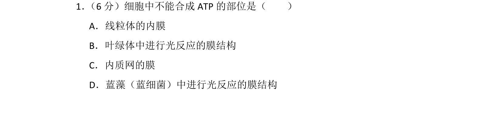
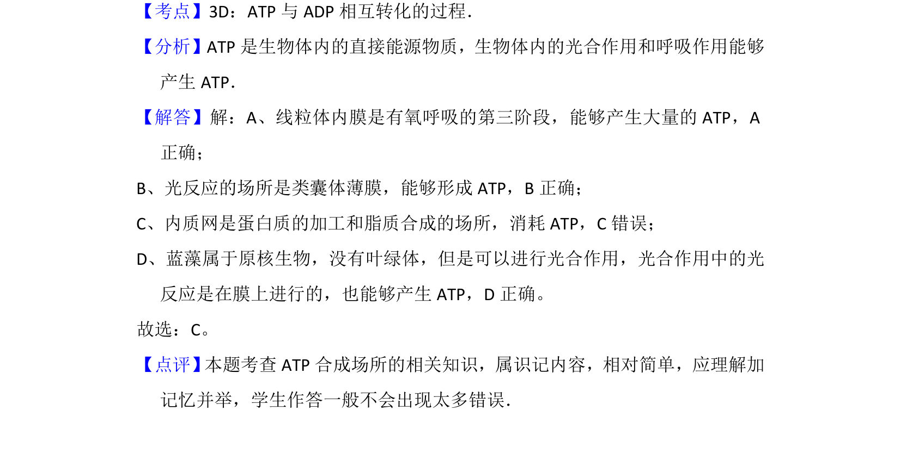

## 题面

## 摘要

考查ATP合成部位，区分不同细胞结构及蓝藻光合作用中ATP的产生场所

## 关联考点

- [[458-ATP合成|ATP合成]]
- [[线粒体内膜]]
- [[叶绿体类囊体薄膜]]
- [[原核细胞光合作用]]

## 答案与解析

> 📄 原 PDF 第 1 页：`素材/真题/北京/2008-2024·（北京）生物高考真题/2012年高考生物试卷（北京）（解析卷）.pdf`
