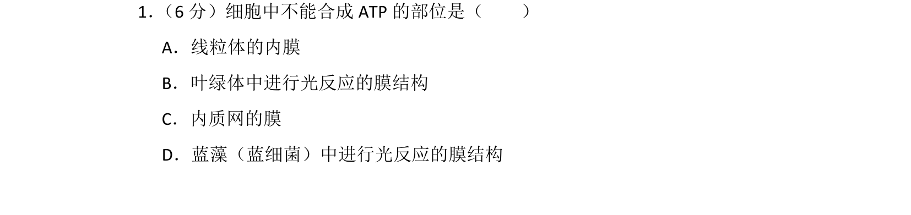
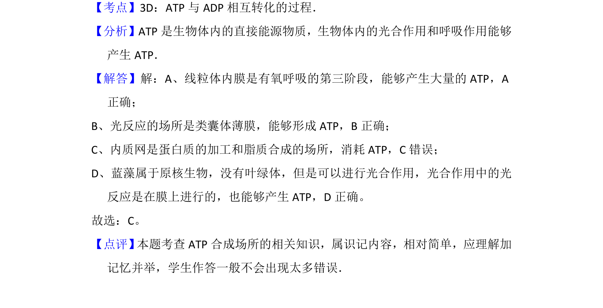

## 题面

## 摘要

考查ATP合成部位，区分不同细胞结构及蓝藻光合作用中ATP的产生场所

## 关联考点

- [[458-ATP合成|ATP合成]]
- [[线粒体内膜]]
- [[叶绿体类囊体薄膜]]
- [[原核细胞光合作用]]

## 答案与解析

> 📄 原 PDF 第 1 页：`素材/真题/北京/2008-2024·（北京）生物高考真题/2012年高考生物试卷（北京）（解析卷）.pdf`

<!-- 题干文本-start -->
## 题干文本
1． （6分）细胞中不能合成ATP的部位是（　　）
A．线粒体的内膜
B．叶绿体中进行光反应的膜结构
C．内质网的膜
D．蓝藻（蓝细菌）中进行光反应的膜结构
<!-- 题干文本-end -->

<!-- 解析文本-start -->
## 解析文本
【考点】3D：ATP与ADP相互转化的过程．菁优网版权所有
【分析】ATP是生物体内的直接能源物质，生物体内的光合作用和呼吸作用能够
产生ATP．
【解答】解：A、线粒体内膜是有氧呼吸的第三阶段，能够产生大量的ATP，A
正确；
B、光反应的场所是类囊体薄膜，能够形成ATP，B正确；
C、内质网是蛋白质的加工和脂质合成的场所，消耗ATP，C错误；
D、蓝藻属于原核生物，没有叶绿体，但是可以进行光合作用，光合作用中的光
反应是在膜上进行的，也能够产生ATP，D正确。
故选：C。
【点评】 本题考查ATP合成场所的相关知识，属识记内容，相对简单，应理解加
记忆并举，学生作答一般不会出现太多错误．
<!-- 解析文本-end -->
