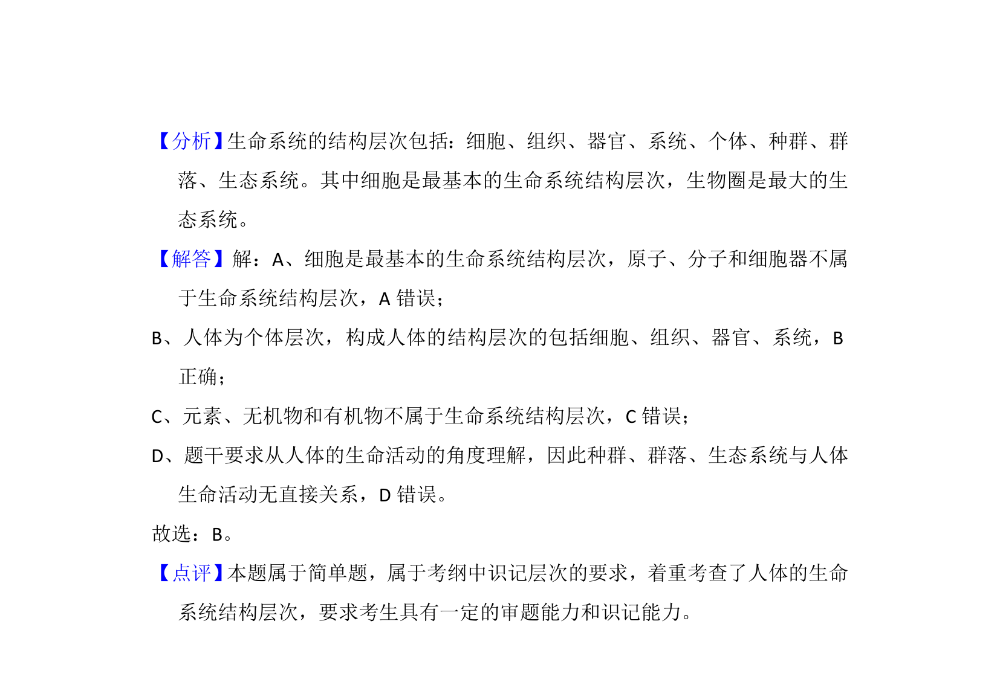

## 题面

## 摘要

该题考查从生命活动角度理解人体的结构层次，区分微观化学组成与生命系统层次。

## 关联考点

- [[207-生命系统的结构层次|生命系统的结构层次]]
- [[人体结构层次]]
- [[209-细胞学说|细胞学说]]

## 答案与解析

> 📄 原 PDF 第 1 页：`素材/真题/北京/2008-2024·（北京）生物高考真题/2012年高考生物试卷（北京）（解析卷）.pdf`
