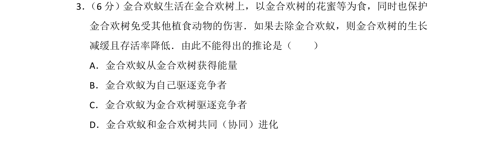
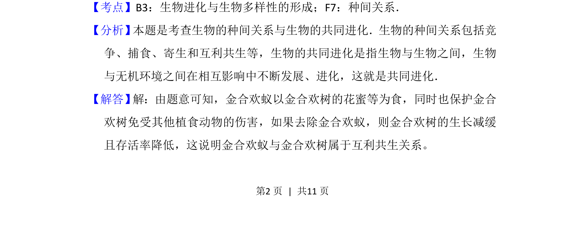
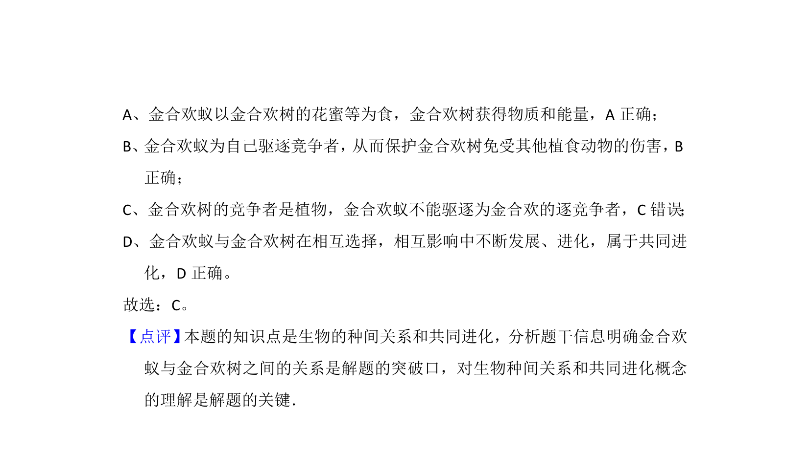

## 题面

## 摘要

金合欢蚁与金合欢树的互利共生关系及种间关系判断

## 关联考点

- [[022-生物因素|种间关系]]
- [[308-共同进化|协同进化]]

## 答案与解析

> 📄 原 PDF 第 2 页：`素材/真题/北京/2008-2024·（北京）生物高考真题/2012年高考生物试卷（北京）（解析卷）.pdf`

<!-- 题干文本-start -->
## 题干文本
3． （6分）金合欢蚁生活在金合欢树上，以金合欢树的花蜜等为食，同时也保护
金合欢树免受其他植食动物的伤害．如果去除金合欢蚁，则金合欢树的生长
减缓且存活率降低．由此不能得出的推论是（　　）
A．金合欢蚁从金合欢树获得能量
B．金合欢蚁为自己驱逐竞争者
C．金合欢蚁为金合欢树驱逐竞争者
D．金合欢蚁和金合欢树共同（协同）进化
<!-- 题干文本-end -->

<!-- 解析文本-start -->
## 解析文本
【考点】B3：生物进化与生物多样性的形成；F7：种间关系．菁优网版权所有
【分析】 本题是考查生物的种间关系与生物的共同进化．生物的种间关系包括竞
争、捕食、寄生和互利共生等，生物的共同进化是指生物与生物之间，生物
与无机环境之间在相互影响中不断发展、进化，这就是共同进化．
【解答】 解：由题意可知，金合欢蚁以金合欢树的花蜜等为食，同时也保护金合
欢树免受其他植食动物的伤害，如果去除金合欢蚁，则金合欢树的生长减缓
且存活率降低，这说明金合欢蚁与金合欢树属于互利共生关系。
<!-- 解析文本-end -->
