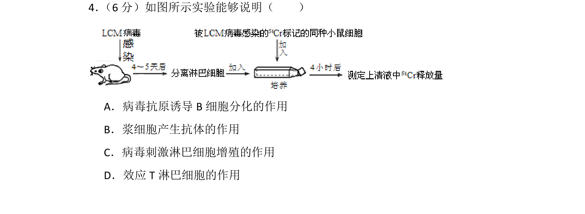
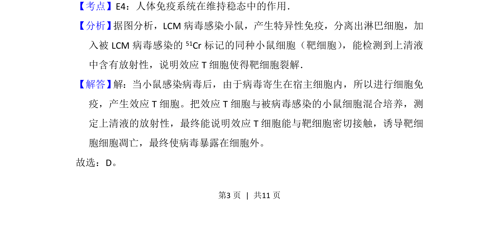
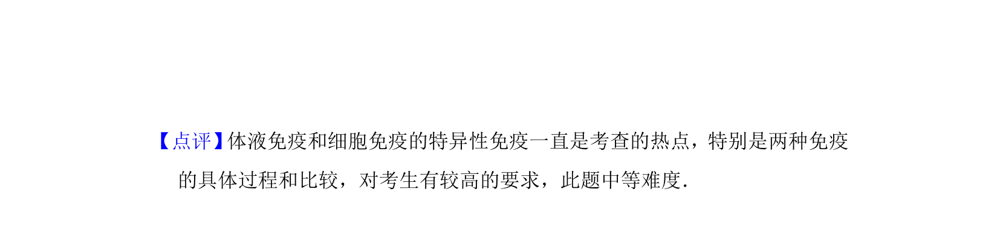

## 题面

## 摘要

该题考查病毒感染的细胞免疫过程中效应T细胞识别并裂解靶细胞的功能。

## 关联考点

- [[359-细胞免疫|细胞免疫]]
- [[效应T细胞]]
- [[靶细胞裂解]]
- [[人体免疫系统]]

## 答案与解析

> 📄 原 PDF 第 3 页：`素材/真题/北京/2008-2024·（北京）生物高考真题/2012年高考生物试卷（北京）（解析卷）.pdf`
