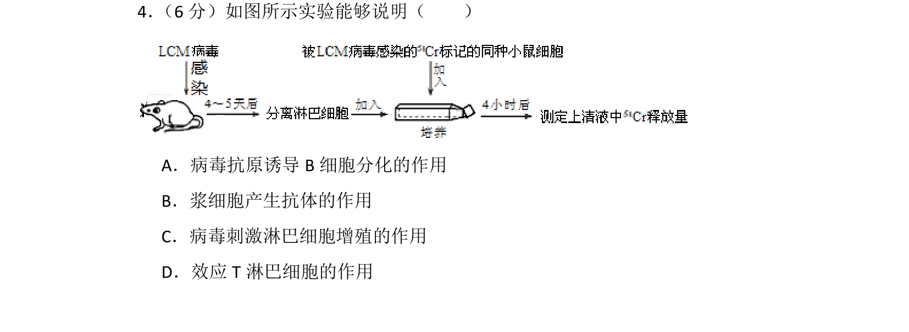
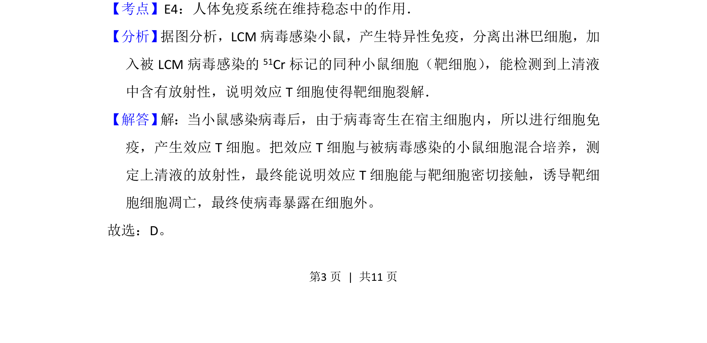
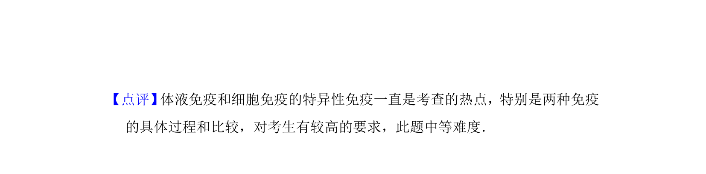

## 题面

## 摘要

该题考查病毒感染的细胞免疫过程中效应T细胞识别并裂解靶细胞的功能。

## 关联考点

- [[359-细胞免疫|细胞免疫]]
- [[效应T细胞]]
- [[靶细胞裂解]]
- [[人体免疫系统]]

## 答案与解析

> 📄 原 PDF 第 3 页：`素材/真题/北京/2008-2024·（北京）生物高考真题/2012年高考生物试卷（北京）（解析卷）.pdf`

<!-- 题干文本-start -->
## 题干文本
4． （6分）如图所示实验能够说明（　　）
A．病毒抗原诱导B细胞分化的作用
B．浆细胞产生抗体的作用
C．病毒刺激淋巴细胞增殖的作用
D．效应T淋巴细胞的作用
<!-- 题干文本-end -->

<!-- 解析文本-start -->
## 解析文本
【考点】E4：人体免疫系统在维持稳态中的作用．菁优网版权所有
【分析】 据图分析，LCM病毒感染小鼠，产生特异性免疫，分离出淋巴细胞，加
入被LCM病毒感染的 51Cr标记的同种小鼠细胞（靶细胞） ，能检测到上清液
中含有放射性，说明效应T细胞使得靶细胞裂解．
【解答】 解：当小鼠感染病毒后，由于病毒寄生在宿主细胞内，所以进行细胞免
疫，产生效应T细胞。把效应T细胞与被病毒感染的小鼠细胞混合培养，测
定上清液的放射性，最终能说明效应T细胞能与靶细胞密切接触，诱导靶细
胞细胞凋亡，最终使病毒暴露在细胞外。
故选：D。
<!-- 解析文本-end -->
