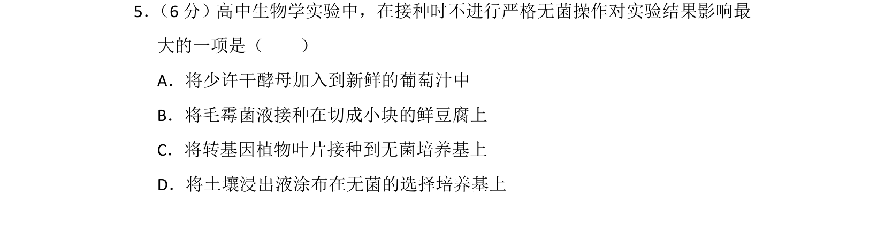
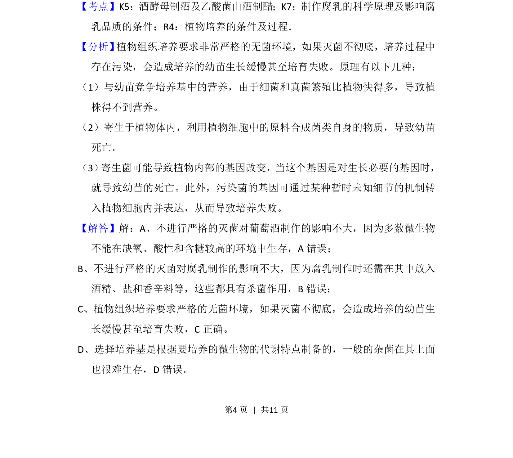
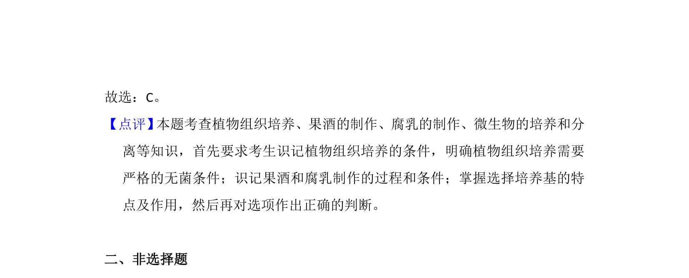

## 题面

## 摘要

考查不同实验中无菌操作的严格程度对实验结果的影响，重点为植物组织培养需严格无菌。

## 关联考点

- [[437-植物组织培养|植物组织培养]]
- [[无菌操作]]
- [[427-培养基|培养基]]
- [[428-微生物培养|微生物培养]]

## 答案与解析

> 📄 原 PDF 第 4 页：`素材/真题/北京/2008-2024·（北京）生物高考真题/2012年高考生物试卷（北京）（解析卷）.pdf`
