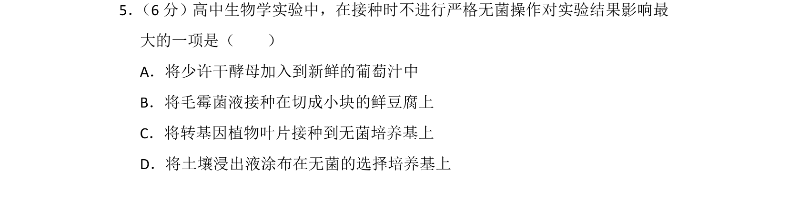
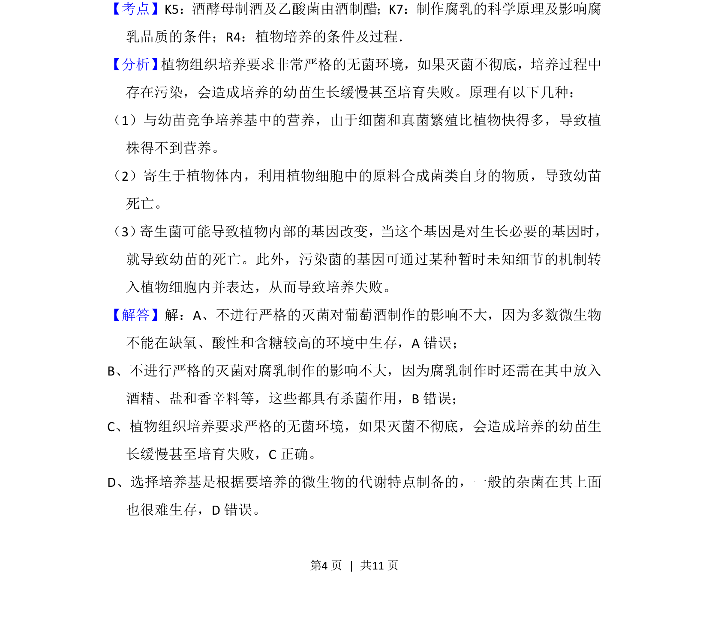
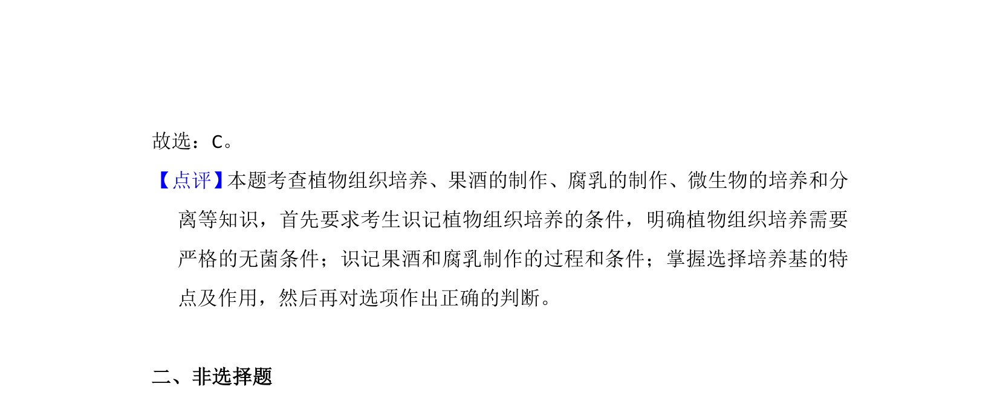

## 题面

## 摘要

考查不同实验中无菌操作的严格程度对实验结果的影响，重点为植物组织培养需严格无菌。

## 关联考点

- [[437-植物组织培养|植物组织培养]]
- [[无菌操作]]
- [[427-培养基|培养基]]
- [[428-微生物培养|微生物培养]]

## 答案与解析

> 📄 原 PDF 第 4 页：`素材/真题/北京/2008-2024·（北京）生物高考真题/2012年高考生物试卷（北京）（解析卷）.pdf`

<!-- 题干文本-start -->
## 题干文本
5． （6分）高中生物学实验中，在接种时不进行严格无菌操作对实验结果影响最
大的一项是（　　）
A．将少许干酵母加入到新鲜的葡萄汁中
B．将毛霉菌液接种在切成小块的鲜豆腐上
C．将转基因植物叶片接种到无菌培养基上
D．将土壤浸出液涂布在无菌的选择培养基上
<!-- 题干文本-end -->

<!-- 解析文本-start -->
## 解析文本
【考点】K5：酒酵母制酒及乙酸菌由酒制醋；K7：制作腐乳的科学原理及影响腐
乳品质的条件；R4：植物培养的条件及过程．菁优网版权所有
【分析】 植物组织培养要求非常严格的无菌环境，如果灭菌不彻底，培养过程中
存在污染，会造成培养的幼苗生长缓慢甚至培育失败。原理有以下几种：
（1）与幼苗竞争培养基中的营养，由于细菌和真菌繁殖比植物快得多，导致植
株得不到营养。
（2）寄生于植物体内，利用植物细胞中的原料合成菌类自身的物质，导致幼苗
死亡。
（3） 寄生菌可能导致植物内部的基因改变，当这个基因是对生长必要的基因时，
就导致幼苗的死亡。此外，污染菌的基因可通过某种暂时未知细节的机制转
入植物细胞内并表达，从而导致培养失败。
【解答】解：A、不进行严格的灭菌对葡萄酒制作的影响不大，因为多数微生物
不能在缺氧、酸性和含糖较高的环境中生存，A错误；
B、不进行严格的灭菌对腐乳制作的影响不大，因为腐乳制作时还需在其中放入
酒精、盐和香辛料等，这些都具有杀菌作用，B错误；
C、植物组织培养要求严格的无菌环境，如果灭菌不彻底，会造成培养的幼苗生
长缓慢甚至培育失败，C正确。
D、选择培养基是根据要培养的微生物的代谢特点制备的，一般的杂菌在其上面
也很难生存，D错误。
<!-- 解析文本-end -->
