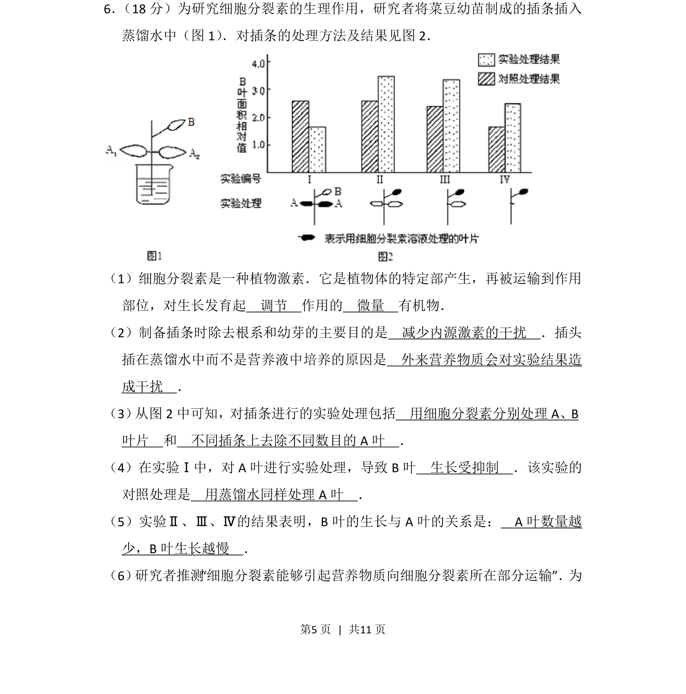
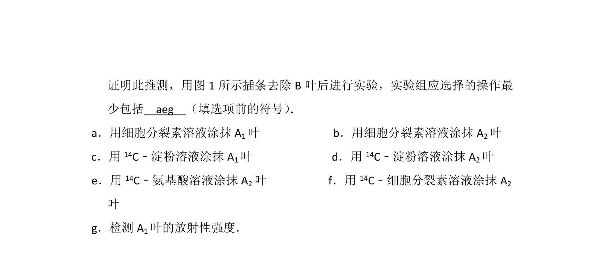
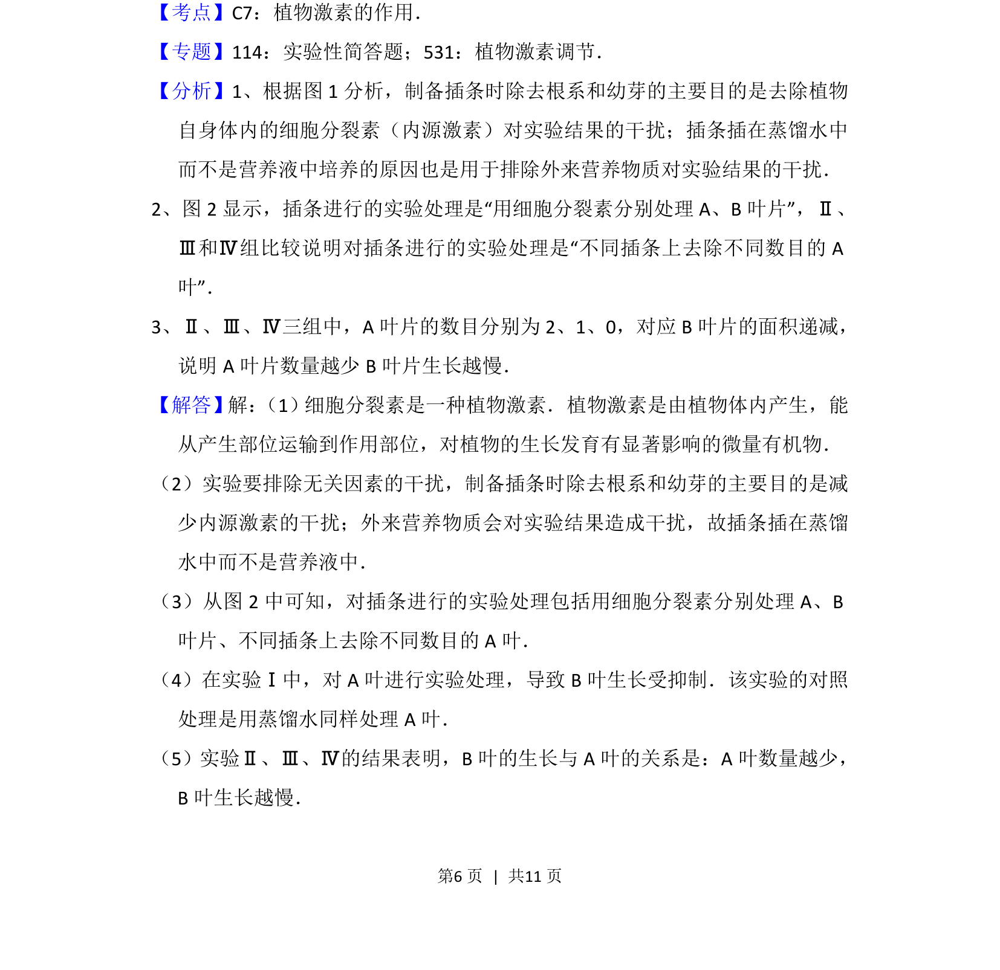
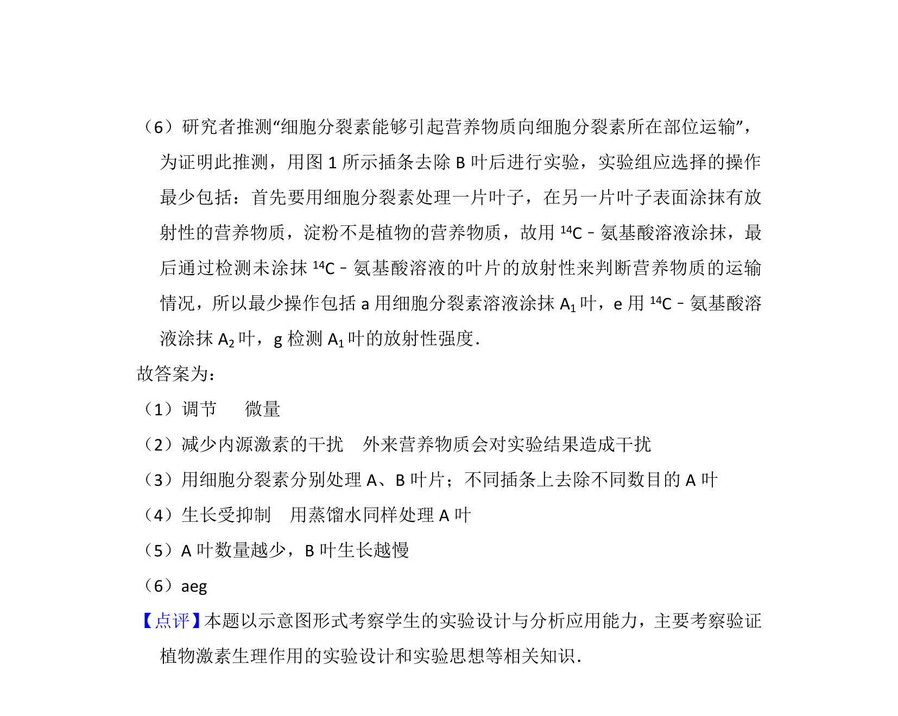

## 题面

## 摘要

研究细胞分裂素的生理作用，通过插条实验分析激素调节、实验处理和对照设计。

## 关联考点

- [[349-细胞分裂素|细胞分裂素]]
- [[345-植物激素|植物激素]]
- [[482-实验设计|实验设计]]
- [[对照处理]]

## 答案与解析

> 📄 原 PDF 第 5 页：`素材/真题/北京/2008-2024·（北京）生物高考真题/2012年高考生物试卷（北京）（解析卷）.pdf`

<!-- 题干文本-start -->
## 题干文本
6． （18分）为研究细胞分裂素的生理作用，研究者将菜豆幼苗制成的插条插入
蒸馏水中（图1） ．对插条的处理方法及结果见图2．
（1）细胞分裂素是一种植物激素．它是植物体的特定部产生，再被运输到作用
部位，对生长发育起　调节　作用的　微量　有机物．
（2）制备插条时除去根系和幼芽的主要目的是　减少内源激素的干扰　．插头
插在蒸馏水中而不是营养液中培养的原因是　外来营养物质会对实验结果造
成干扰　．
（3） 从图2中可知，对插条进行的实验处理包括　用细胞分裂素分别处理A、B
叶片　和　不同插条上去除不同数目的A叶　．
（4）在实验Ⅰ中，对A叶进行实验处理，导致B叶　生长受抑制　．该实验的
对照处理是　用蒸馏水同样处理A叶　．
（5）实验Ⅱ、Ⅲ、Ⅳ的结果表明，B叶的生长与A叶的关系是：　A叶数量越
少，B叶生长越慢　．
（6） 研究者推测“细胞分裂素能够引起营养物质向细胞分裂素所在部分运输”． 为
<!-- 题干文本-end -->

<!-- 解析文本-start -->
## 解析文本

<!-- 解析文本-end -->
