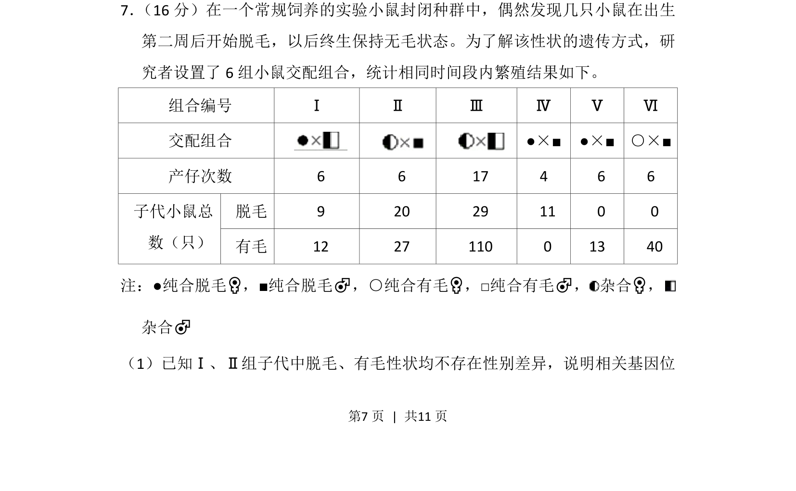
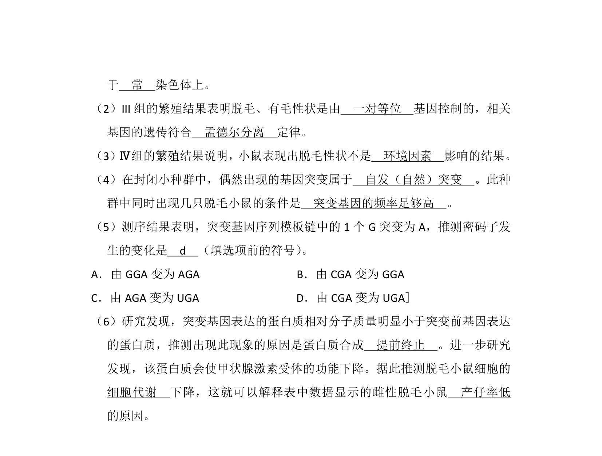
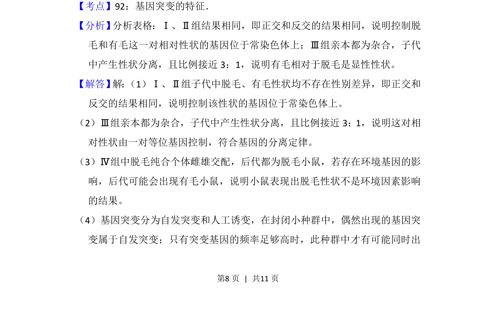
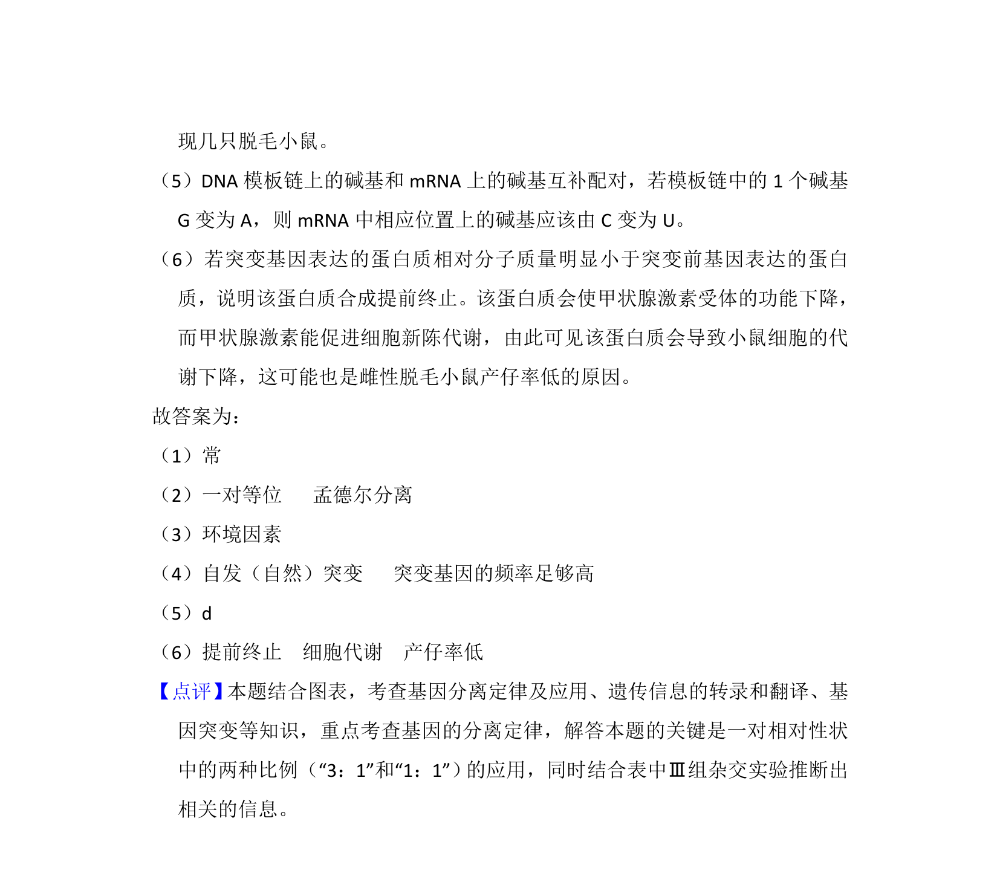

## 题面

## 摘要

该题通过小鼠交配实验数据考查遗传方式的判断及基因位置的推断。

## 关联考点

- [[804-常染色体遗传|常染色体遗传]]
- [[性状与性别无关]]
- [[517-遗传规律|遗传规律]]

## 答案与解析

> 📄 原 PDF 第 7 页：`素材/真题/北京/2008-2024·（北京）生物高考真题/2012年高考生物试卷（北京）（解析卷）.pdf`
