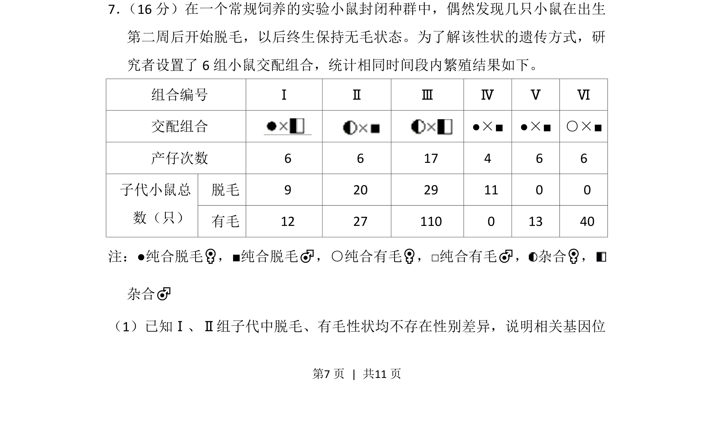
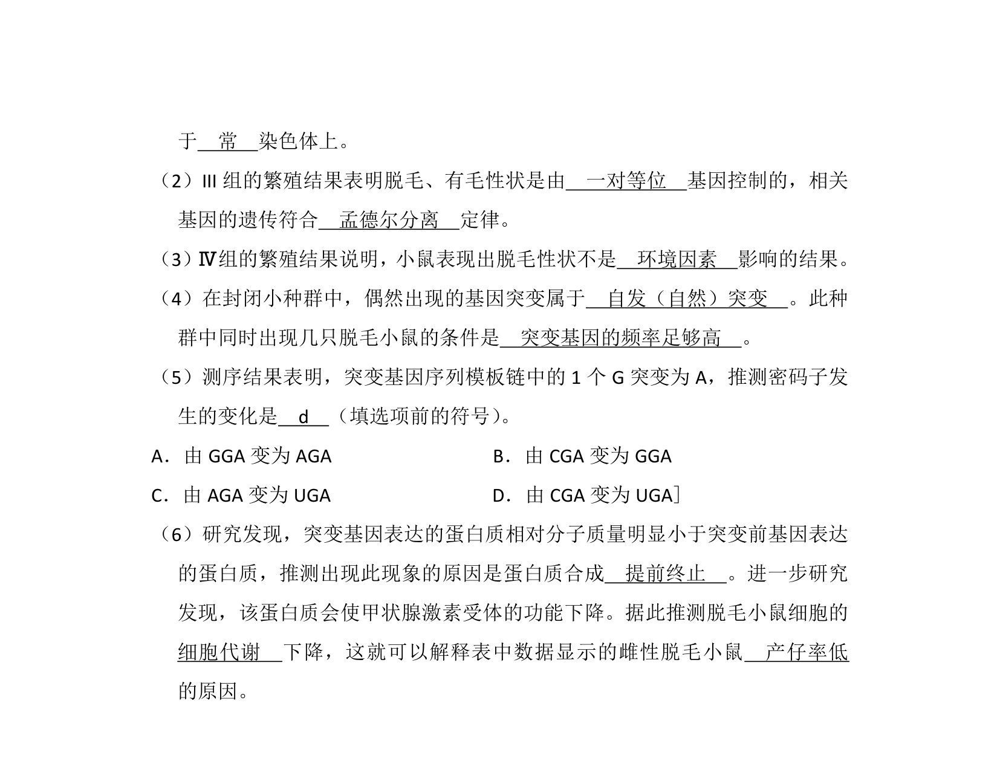
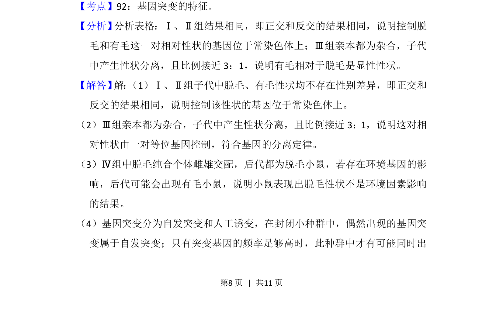
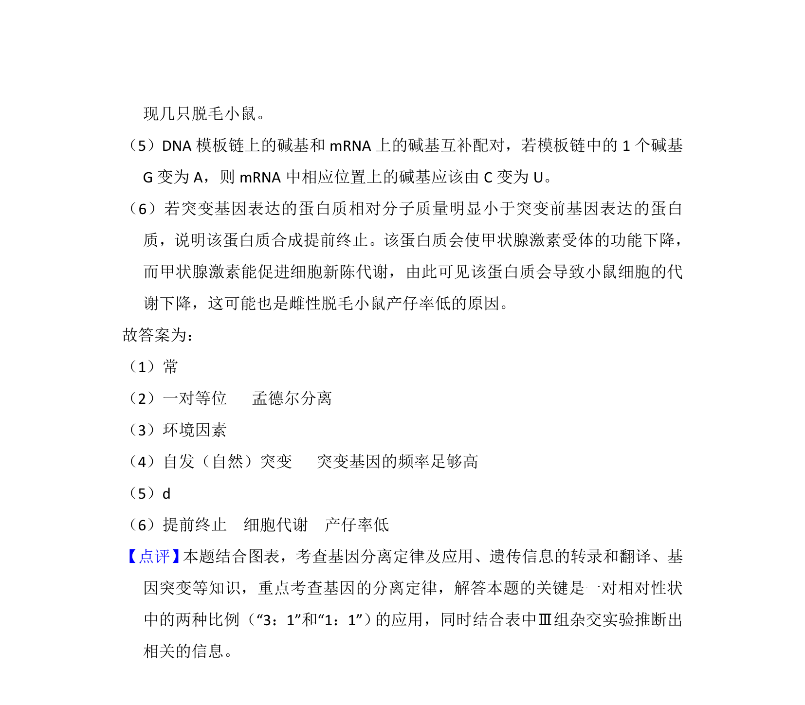

## 题面

## 摘要

该题通过小鼠交配实验数据考查遗传方式的判断及基因位置的推断。

## 关联考点

- [[804-常染色体遗传|常染色体遗传]]
- [[性状与性别无关]]
- [[517-遗传规律|遗传规律]]

## 答案与解析

> 📄 原 PDF 第 7 页：`素材/真题/北京/2008-2024·（北京）生物高考真题/2012年高考生物试卷（北京）（解析卷）.pdf`

<!-- 题干文本-start -->
## 题干文本
7． （16分）在一个常规饲养的实验小鼠封闭种群中，偶然发现几只小鼠在出生
第二周后开始脱毛，以后终生保持无毛状态。为了解该性状的遗传方式，研
究者设置了6组小鼠交配组合，统计相同时间段内繁殖结果如下。
 组合编号 Ⅰ Ⅱ Ⅲ Ⅳ Ⅴ Ⅵ
 交配组合  
  
  
 ●×■ ●×■ ○×■
 产仔次数  6  6  17 4  6 6 
 脱毛  9  20  29  11  0  0 子代小鼠总
数（只）  有毛  12  27  110  0 13  40
注：●纯合脱毛♀，■纯合脱毛♂，○纯合有毛♀，□纯合有毛♂， 杂合♀，
杂合♂
（1）已知Ⅰ、Ⅱ组子代中脱毛、有毛性状均不存在性别差异，说明相关基因位
<!-- 题干文本-end -->

<!-- 解析文本-start -->
## 解析文本

<!-- 解析文本-end -->
