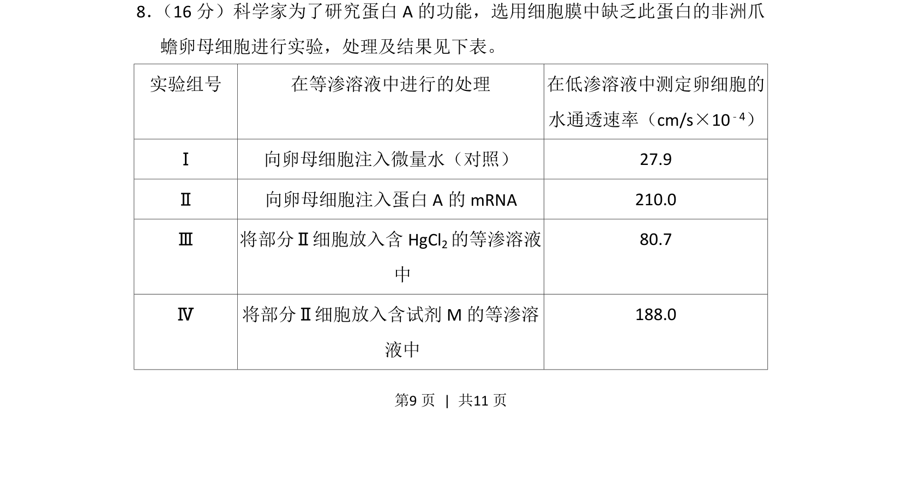
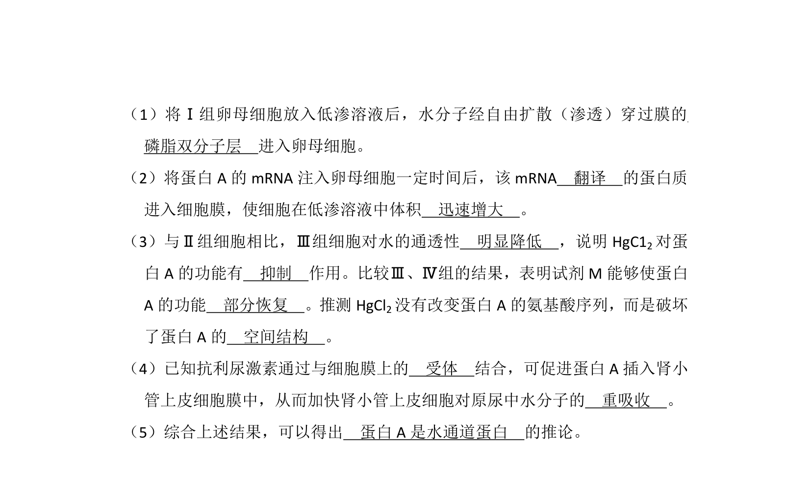
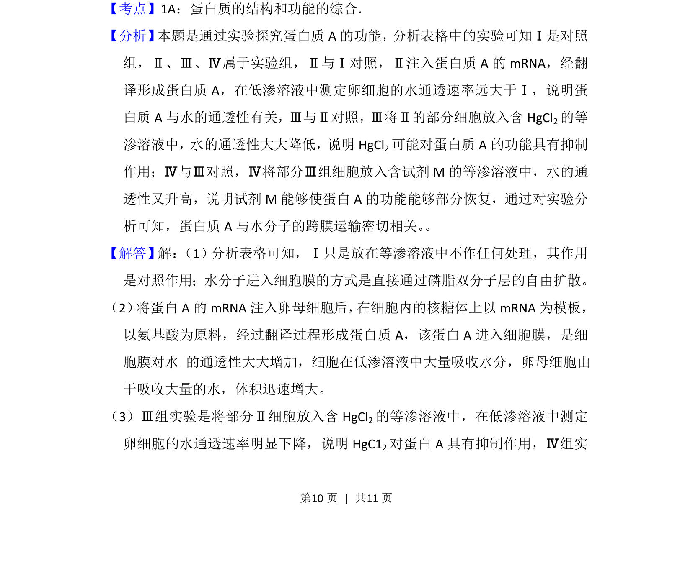
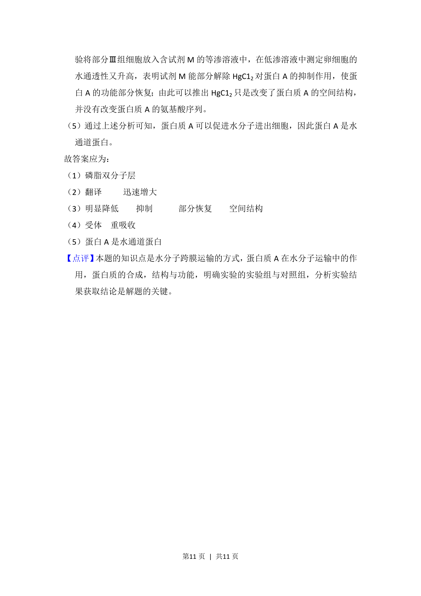

## 题面

## 摘要

本题通过非洲爪蟾卵母细胞实验，探究蛋白A的表达及其对细胞水通透性的影响，并分析HgCl₂和试剂M的干扰作用。

## 关联考点

- [[479-基因表达|基因表达]]
- [[625-水通道蛋白|水通道蛋白]]
- [[696-蛋白质功能|蛋白质功能]]

## 答案与解析

> 📄 原 PDF 第 9 页：`素材/真题/北京/2008-2024·（北京）生物高考真题/2012年高考生物试卷（北京）（解析卷）.pdf`
