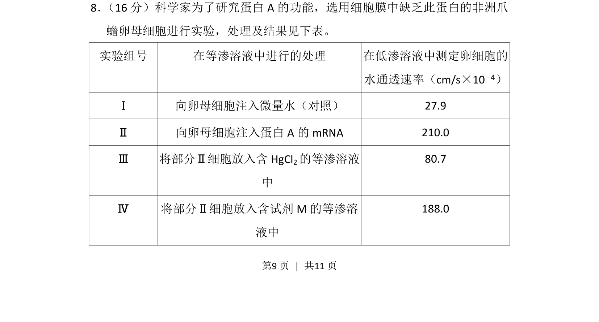
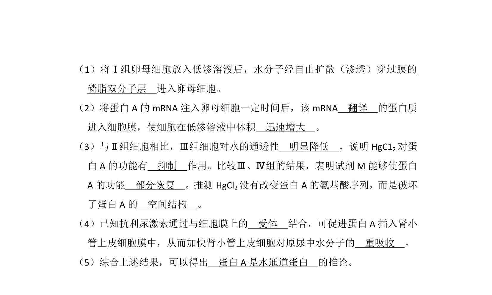
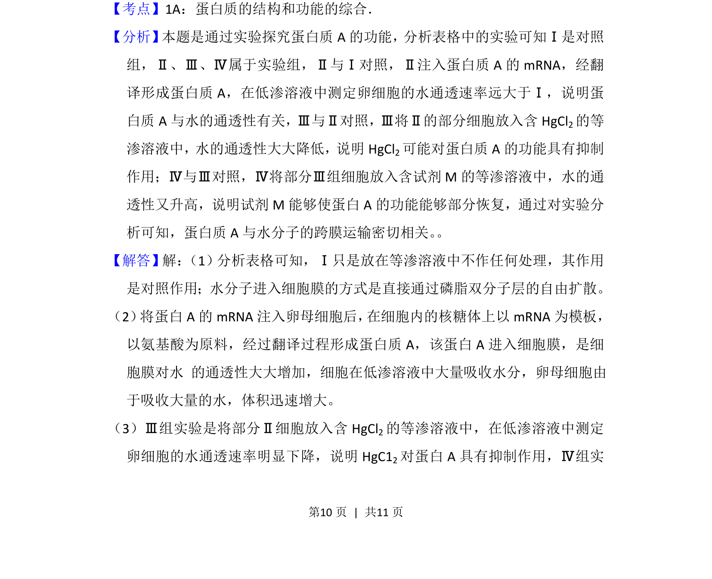
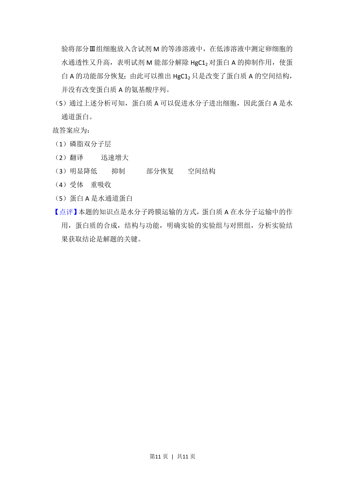

## 题面

## 摘要

本题通过非洲爪蟾卵母细胞实验，探究蛋白A的表达及其对细胞水通透性的影响，并分析HgCl₂和试剂M的干扰作用。

## 关联考点

- [[843-基因的表达|基因表达]]
- [[625-水通道蛋白|水通道蛋白]]
- [[696-蛋白质功能|蛋白质功能]]

## 答案与解析

> 📄 原 PDF 第 9 页：`素材/真题/北京/2008-2024·（北京）生物高考真题/2012年高考生物试卷（北京）（解析卷）.pdf`

<!-- 题干文本-start -->
## 题干文本
8． （16分）科学家为了研究蛋白A的功能，选用细胞膜中缺乏此蛋白的非洲爪
蟾卵母细胞进行实验，处理及结果见下表。
实验组号 在等渗溶液中进行的处理 在低渗溶液中测定卵细胞的
水通透速率（cm/s×10﹣4）
Ⅰ 向卵母细胞注入微量水（对照） 27.9
Ⅱ 向卵母细胞注入蛋白A的mRNA 210.0
Ⅲ 将部分Ⅱ细胞放入含HgCl 2的等渗溶液
中
80.7
Ⅳ 将部分Ⅱ细胞放入含试剂M的等渗溶
液中
188.0
<!-- 题干文本-end -->

<!-- 解析文本-start -->
## 解析文本

<!-- 解析文本-end -->
