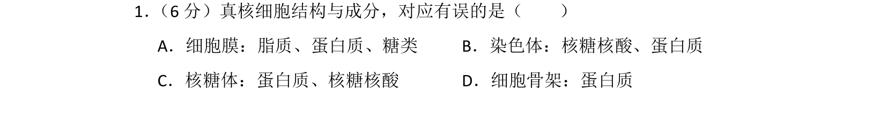
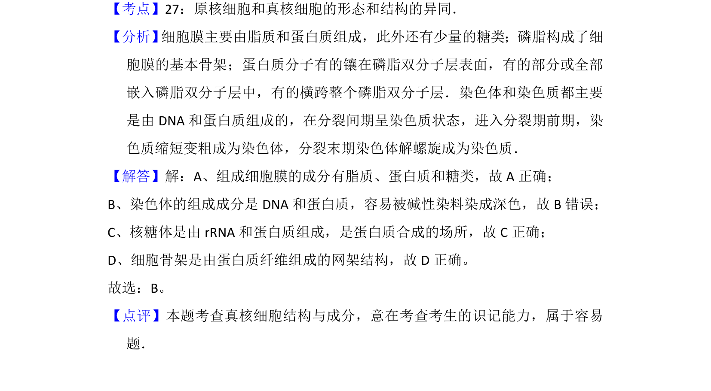

## 题面

## 摘要

本题考查真核细胞结构（细胞膜、染色体、核糖体、细胞骨架）的化学成分。

## 关联考点

- [[682-细胞结构|细胞结构]]
- [[成分]]
- [[213-核酸|核酸]]
- [[134-蛋白质|蛋白质]]

## 答案与解析

> 📄 原 PDF 第 1 页：`素材/真题/北京/2008-2024·（北京）生物高考真题/2013年高考生物试卷（北京）（解析卷）.pdf`
