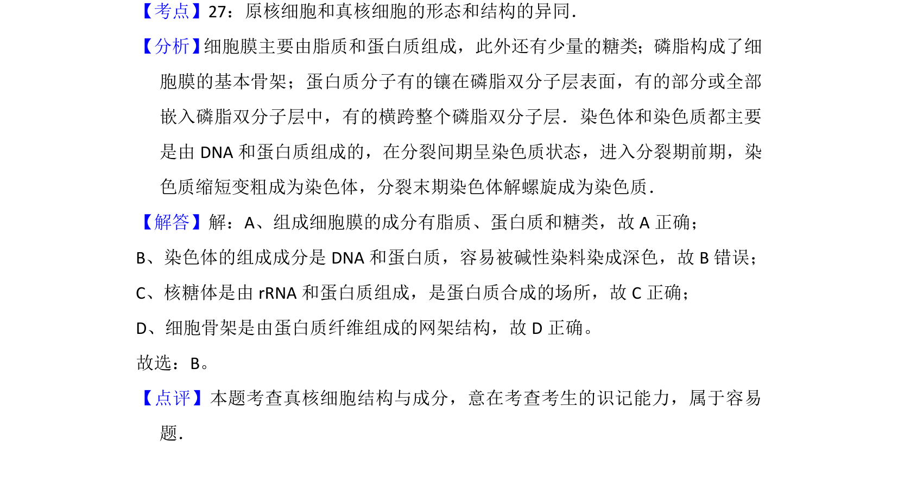

## 题面

## 摘要

本题考查真核细胞结构（细胞膜、染色体、核糖体、细胞骨架）的化学成分。

## 关联考点

- [[682-细胞结构|细胞结构]]
- [[成分]]
- [[213-核酸|核酸]]
- [[134-蛋白质|蛋白质]]

## 答案与解析

> 📄 原 PDF 第 1 页：`素材/真题/北京/2008-2024·（北京）生物高考真题/2013年高考生物试卷（北京）（解析卷）.pdf`

<!-- 题干文本-start -->
## 题干文本
1． （6分）真核细胞结构与成分，对应有误的是（　　）
A．细胞膜：脂质、蛋白质、糖类B．染色体：核糖核酸、蛋白质
C．核糖体：蛋白质、核糖核酸D．细胞骨架：蛋白质
<!-- 题干文本-end -->

<!-- 解析文本-start -->
## 解析文本
【考点】27：原核细胞和真核细胞的形态和结构的异同．菁优网版权所有
【分析】 细胞膜主要由脂质和蛋白质组成，此外还有少量的糖类；磷脂构成了细
胞膜的基本骨架；蛋白质分子有的镶在磷脂双分子层表面，有的部分或全部
嵌入磷脂双分子层中，有的横跨整个磷脂双分子层．染色体和染色质都主要
是由DNA和蛋白质组成的，在分裂间期呈染色质状态，进入分裂期前期，染
色质缩短变粗成为染色体，分裂末期染色体解螺旋成为染色质．
【解答】解：A、组成细胞膜的成分有脂质、蛋白质和糖类，故A正确；
B、染色体的组成成分是DNA和蛋白质，容易被碱性染料染成深色，故B错误；
C、核糖体是由rRNA和蛋白质组成，是蛋白质合成的场所，故C正确；
D、细胞骨架是由蛋白质纤维组成的网架结构，故D正确。
故选：B。
【点评】本题考查真核细胞结构与成分，意在考查考生的识记能力，属于容易
题．
<!-- 解析文本-end -->
