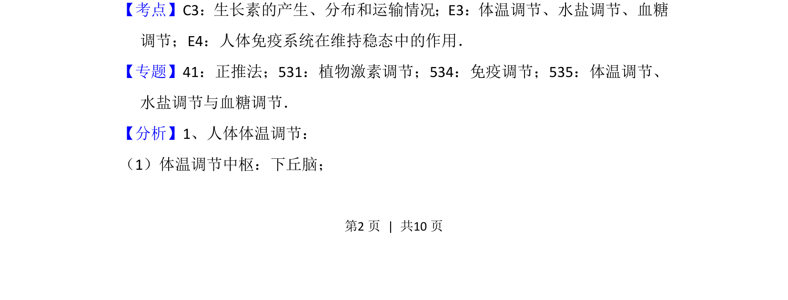
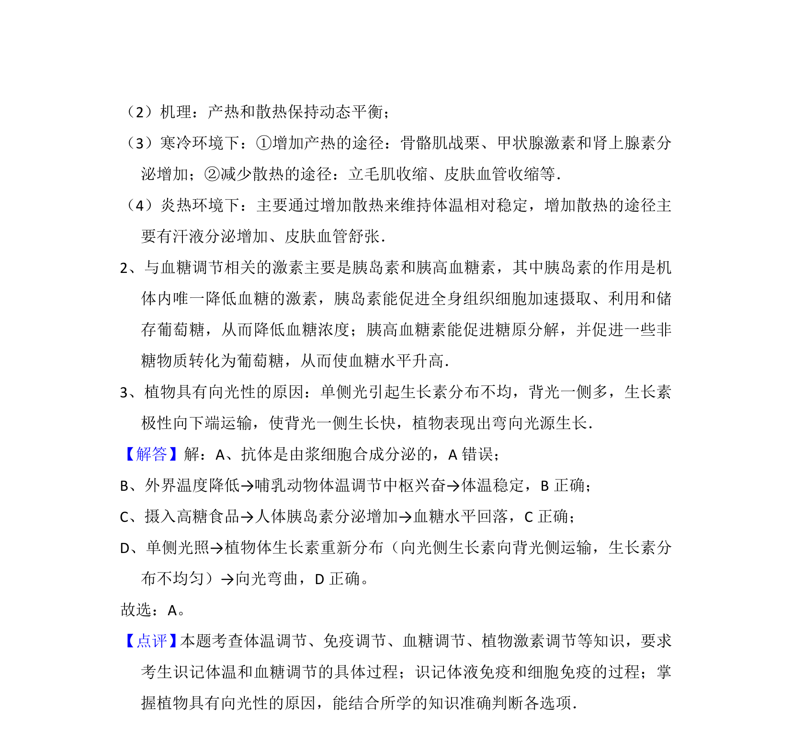

## 题面

## 摘要

本题考查生物体对刺激的调节反应，涉及免疫、体温、血糖和植物向光性。

## 关联考点

- [[156-免疫|免疫调节]]
- [[542-体温调节|体温调节]]
- [[512-血糖调节|血糖调节]]
- [[生长素分布]]

## 答案与解析

> 📄 原 PDF 第 2 页：`素材/真题/北京/2008-2024·（北京）生物高考真题/2013年高考生物试卷（北京）（解析卷）.pdf`
