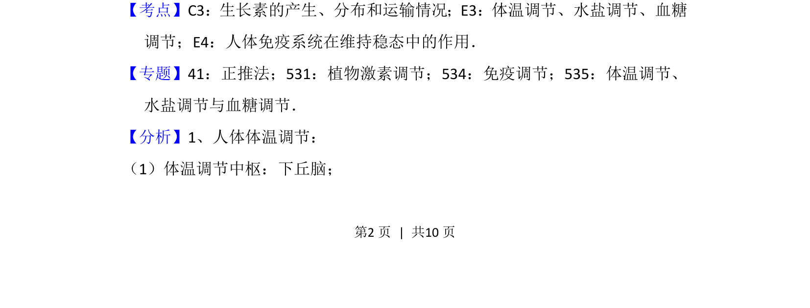
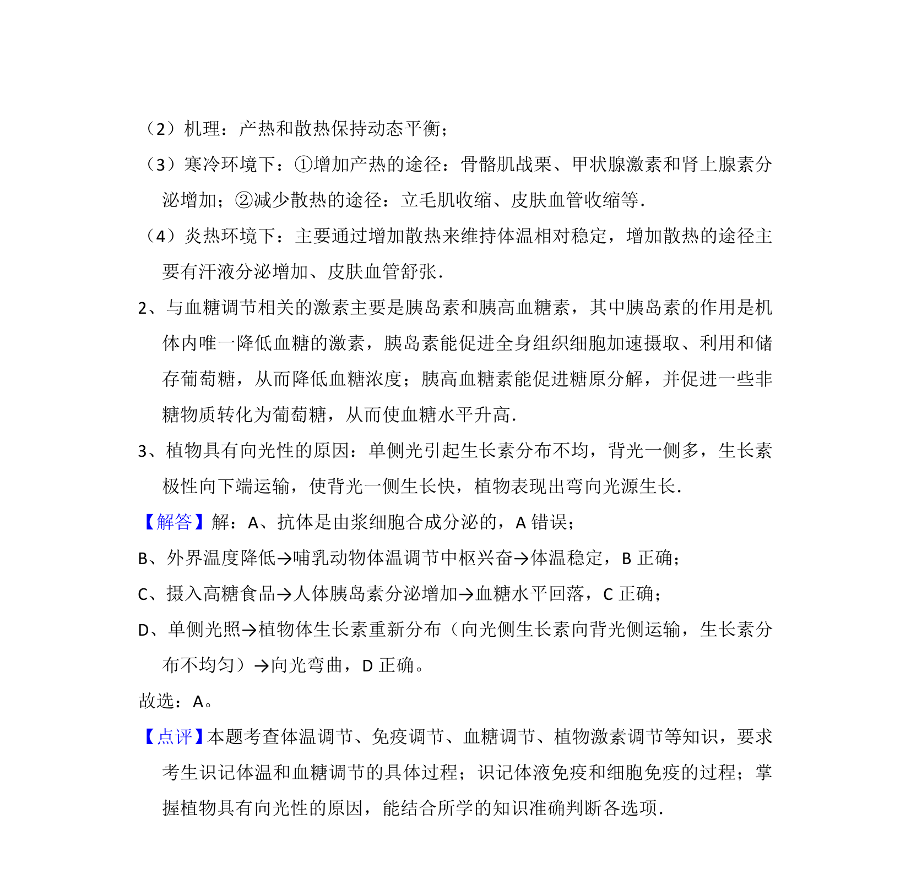

## 题面

## 摘要

本题考查生物体对刺激的调节反应，涉及免疫、体温、血糖和植物向光性。

## 关联考点

- [[156-免疫|免疫调节]]
- [[542-体温调节|体温调节]]
- [[512-血糖调节|血糖调节]]
- [[生长素分布]]

## 答案与解析

> 📄 原 PDF 第 2 页：`素材/真题/北京/2008-2024·（北京）生物高考真题/2013年高考生物试卷（北京）（解析卷）.pdf`

<!-- 题干文本-start -->
## 题干文本
3． （6分）有关生物体对刺激做出反应的表述，错误的是（　　）
A．病毒感染→人体T细胞分泌特异性抗体→清除病毒
B．外界温度降低→哺乳动物体温调节中枢兴奋→体温稳定
C．摄入高糖食品→人体胰岛素分泌增加→血糖水平回落
D．单侧光照→植物体生长素重新分布→向光弯曲
<!-- 题干文本-end -->

<!-- 解析文本-start -->
## 解析文本
【考点】C3：生长素的产生、分布和运输情况；E3：体温调节、水盐调节、血糖
调节；E4：人体免疫系统在维持稳态中的作用．菁优网版权所有
【专题】41：正推法；531：植物激素调节；534：免疫调节；535：体温调节、
水盐调节与血糖调节．
【分析】1、人体体温调节：
（1）体温调节中枢：下丘脑；
<!-- 解析文本-end -->
