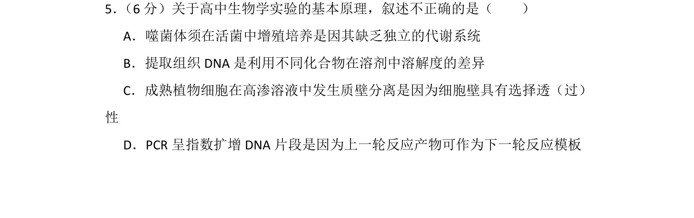
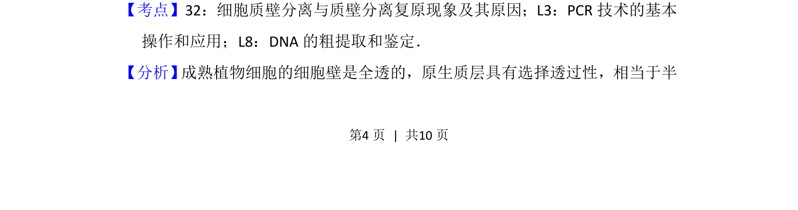
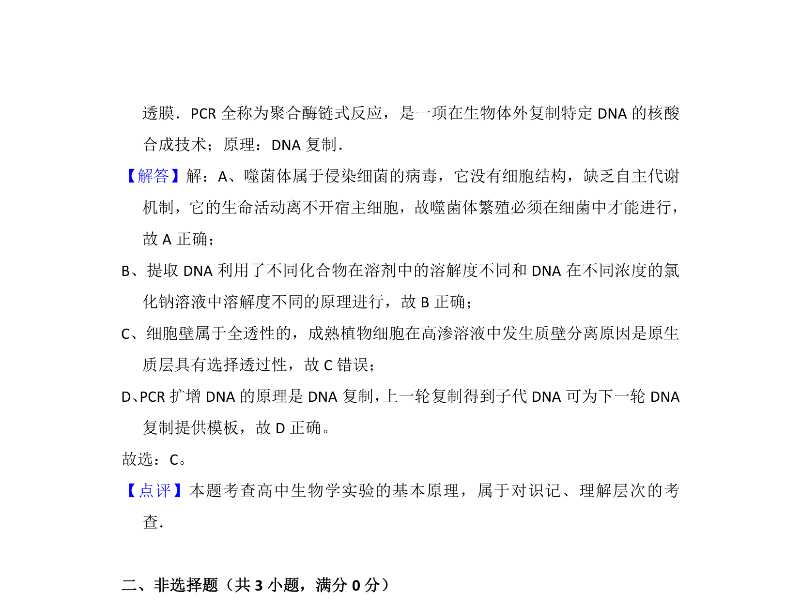

## 题面

## 摘要

本题通过辨析四个高中生物学实验的基本原理，考查常见实验操作与相关概念的准确理解。

## 关联考点

- [[细胞质壁分离]]
- [[选择透过性]]
- [[827-PCR技术|PCR技术]]
- [[DNA粗提取]]

## 答案与解析

> 📄 原 PDF 第 4 页：`素材/真题/北京/2008-2024·（北京）生物高考真题/2013年高考生物试卷（北京）（解析卷）.pdf`
