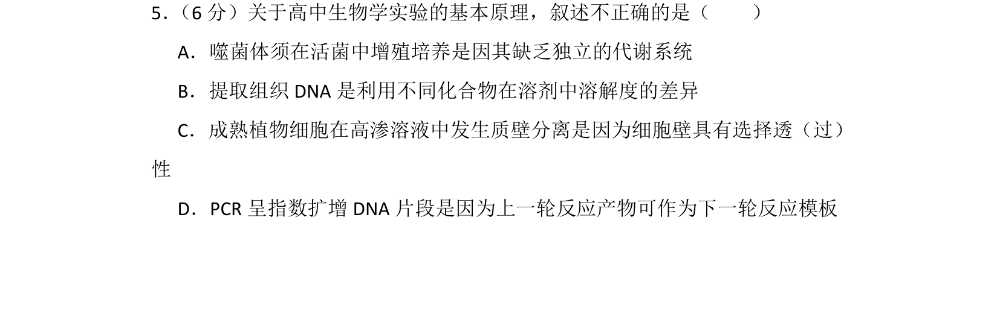
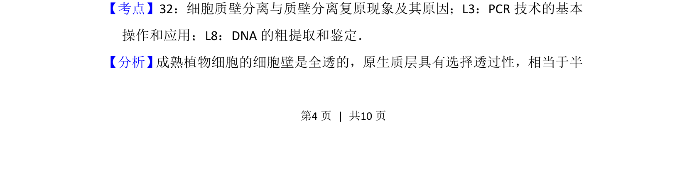
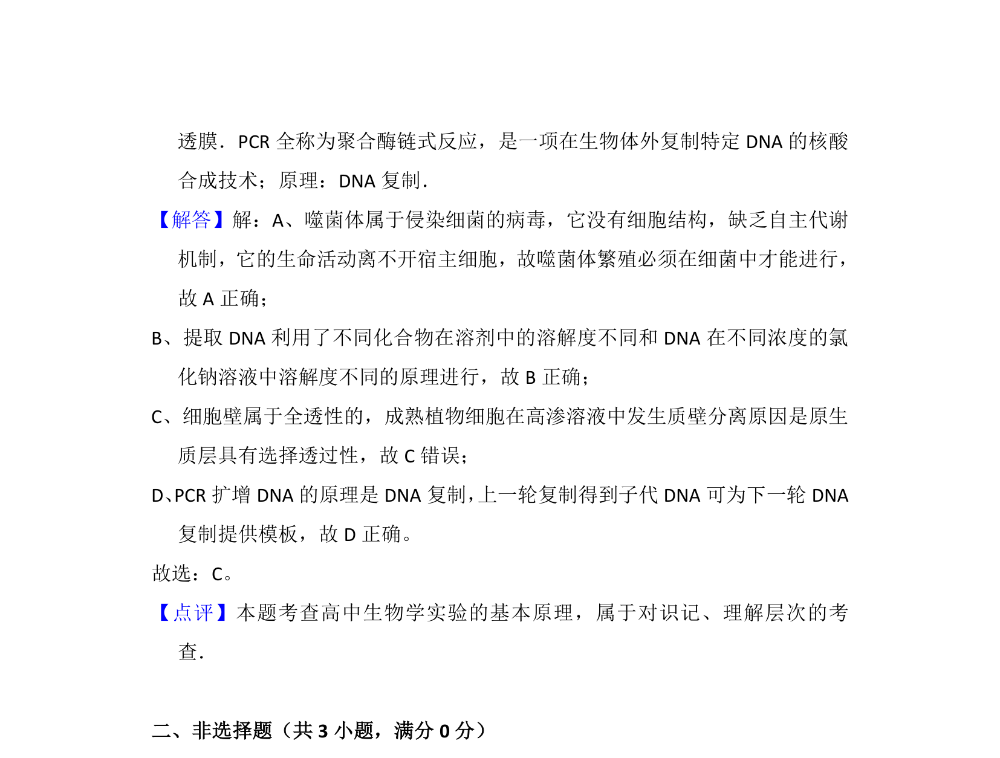

## 题面

## 摘要

本题通过辨析四个高中生物学实验的基本原理，考查常见实验操作与相关概念的准确理解。

## 关联考点

- [[细胞质壁分离]]
- [[905-选择透过性|选择透过性]]
- [[827-PCR技术|PCR技术]]
- [[885-DNA粗提取|DNA粗提取]]

## 答案与解析

> 📄 原 PDF 第 4 页：`素材/真题/北京/2008-2024·（北京）生物高考真题/2013年高考生物试卷（北京）（解析卷）.pdf`

<!-- 题干文本-start -->
## 题干文本
5． （6分）关于高中生物学实验的基本原理，叙述不正确的是（　　）
A．噬菌体须在活菌中增殖培养是因其缺乏独立的代谢系统
B．提取组织DNA是利用不同化合物在溶剂中溶解度的差异
C．成熟植物细胞在高渗溶液中发生质壁分离是因为细胞壁具有选择透（过）
性
D．PCR呈指数扩增DNA片段是因为上一轮反应产物可作为下一轮反应模板
<!-- 题干文本-end -->

<!-- 解析文本-start -->
## 解析文本
【考点】32：细胞质壁分离与质壁分离复原现象及其原因；L3：PCR技术的基本
操作和应用；L8：DNA的粗提取和鉴定．菁优网版权所有
【分析】 成熟植物细胞的细胞壁是全透的，原生质层具有选择透过性，相当于半
<!-- 解析文本-end -->
