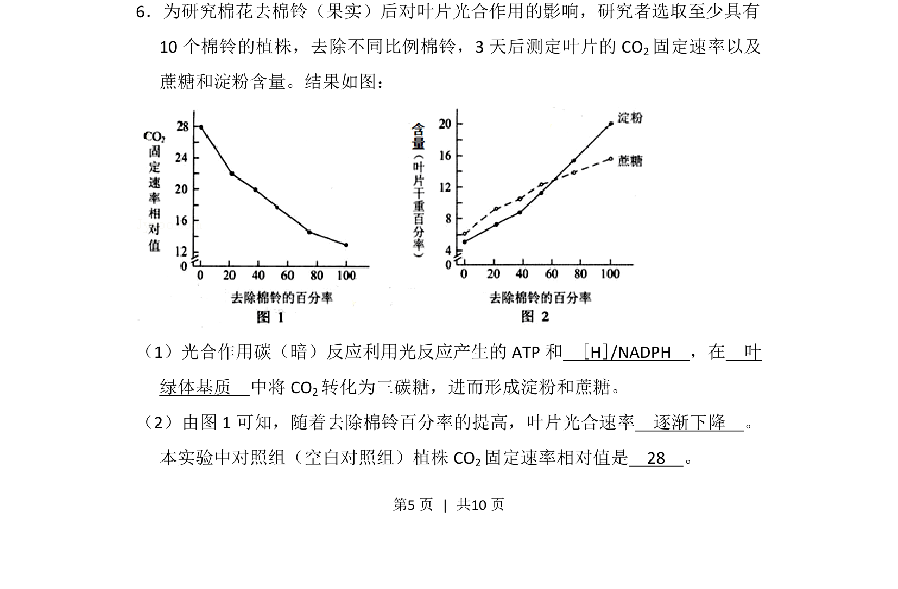
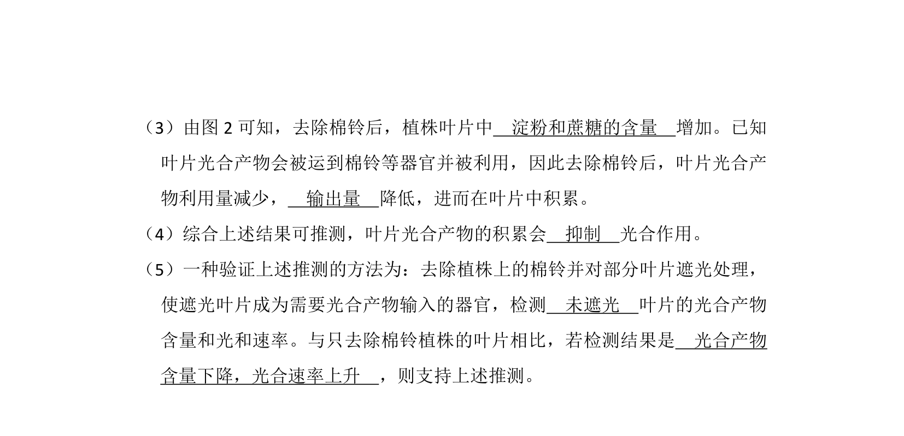
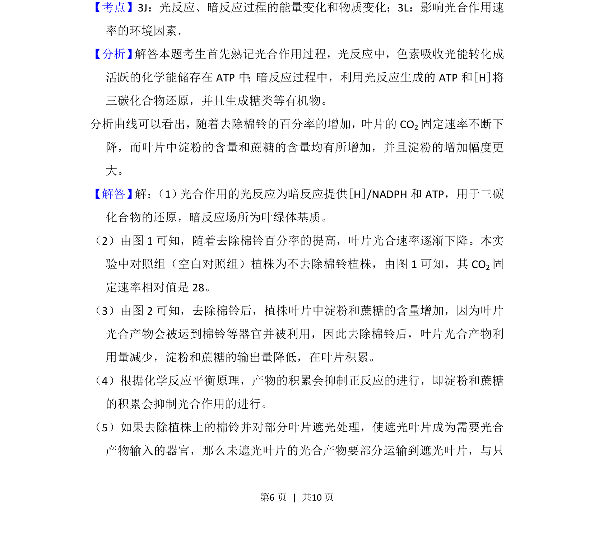
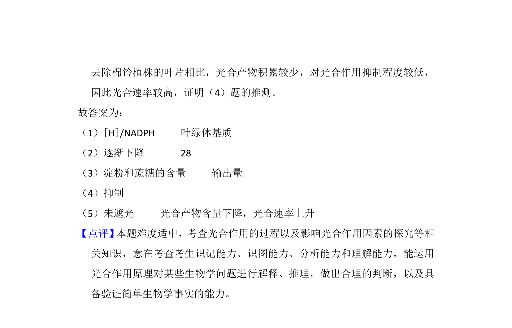

## 题面

## 摘要

研究棉花去棉铃对叶片光合作用的影响，考查光合作用暗反应过程及实验结果分析。

## 关联考点

- [[光合作用暗反应]]
- [[581-实验数据分析|实验数据分析]]
- [[CO2固定]]

## 答案与解析

> 📄 原 PDF 第 5 页：`素材/真题/北京/2008-2024·（北京）生物高考真题/2013年高考生物试卷（北京）（解析卷）.pdf`
