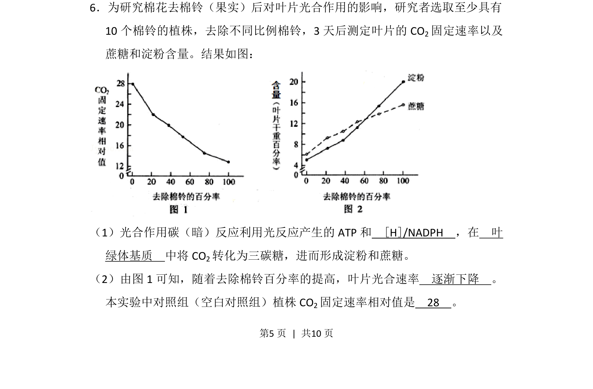
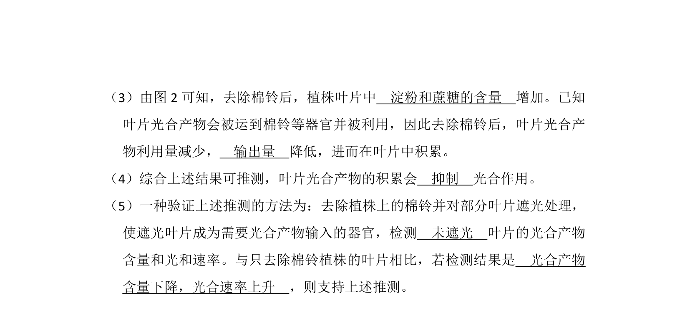
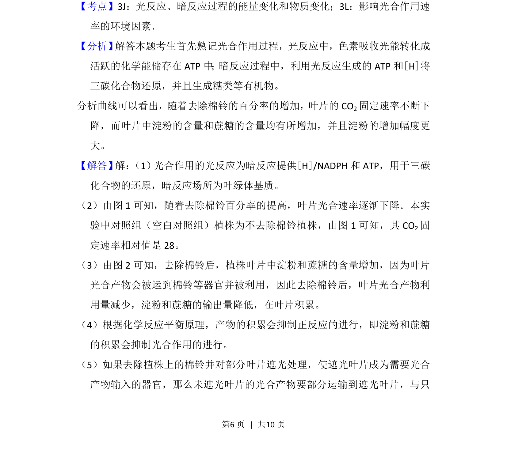
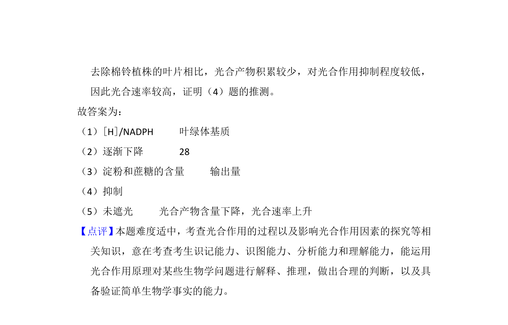

## 题面

## 摘要

研究棉花去棉铃对叶片光合作用的影响，考查光合作用暗反应过程及实验结果分析。

## 关联考点

- [[光合作用暗反应]]
- [[581-实验数据分析|实验数据分析]]
- [[CO2固定]]

## 答案与解析

> 📄 原 PDF 第 5 页：`素材/真题/北京/2008-2024·（北京）生物高考真题/2013年高考生物试卷（北京）（解析卷）.pdf`

<!-- 题干文本-start -->
## 题干文本
6．为研究棉花去棉铃（果实）后对叶片光合作用的影响，研究者选取至少具有
10个棉铃的植株，去除不同比例棉铃，3天后测定叶片的CO 2固定速率以及
蔗糖和淀粉含量。结果如图：
（1）光合作用碳（暗）反应利用光反应产生的ATP和　[H]/NADPH　，在　叶
绿体基质　中将CO 2转化为三碳糖，进而形成淀粉和蔗糖。
（2）由图1可知，随着去除棉铃百分率的提高，叶片光合速率　逐渐下降　。
本实验中对照组（空白对照组）植株CO 2固定速率相对值是　28　。
<!-- 题干文本-end -->

<!-- 解析文本-start -->
## 解析文本

<!-- 解析文本-end -->
